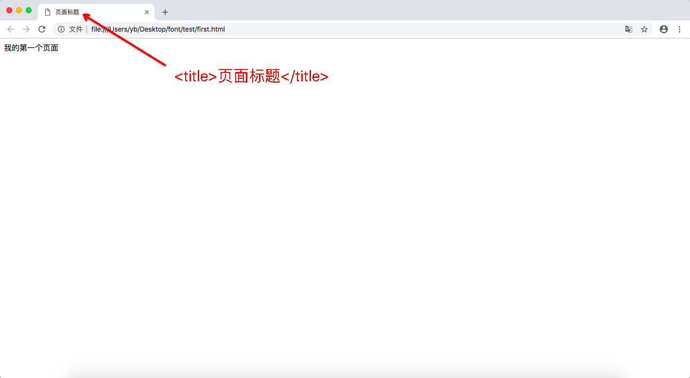
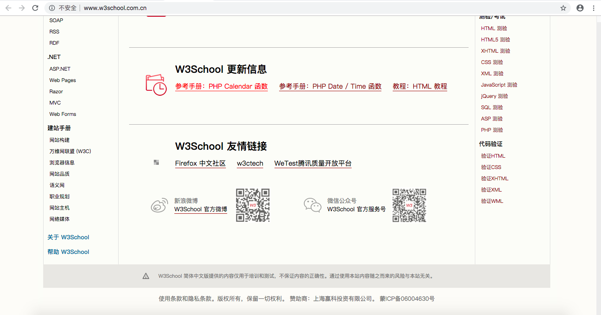

# HTML的基本结构

## 1.页面的三要素

 页面的结构 HTML

 页面的样式 CSS

 页面的行为 JS

## 2.HTML的基本结构

### 2.1 最简单的HTML文件

> 以下是一个最简单的HTLML文件

```html
<!DOCTYPE html>
<html lang="en">
<head>
    <meta charset="UTF-8">
    <title>Document</title>
</head>
<body>
    
</body>
</html>
```

### 2.2 结构说明

**对其中的各个结构做说明**

#### (1) 文档头声明

文档头声明, 也叫文档类型声明

> 代码⌨️

```html
<!DOCTYPE html>
```

> 注意⚠️

* 文档头类型的英文缩写非常好记：  DOC + TYPE (document + type)
* 不是标签
* html 代指 以 HTML5 的标准来解析当前页面
* 文档头类型声明一般会放在文档最开始的位置,浏览器的解析方式从上至下,从左至右


#### (2) `<html>`标签

HTML的根元素

> 代码⌨️

```
<html></html>
```

> 注意⚠️

* HTML的根元素
* 除了文档头声明,其他所有内容都应当放在 HTML 的根元素当中


#### (3) `<head>`标签

HTML的头部

> 代码⌨️

```
<head></head>
```

> 注意⚠️

* head 当中绝大部分内容都是不可见的
* head 当中主要是用于辅助


#### (4) `<title>`标签

设置页面的标题

> 例如



> 代码

```
<title></title>
```


#### (5) `<meta>`标签

定义页面的元数据,元数据本身没有任何含义,它的含义是根据后面的属性来决定的

> 代码

```
<head>
<meta name="description" content="我的第一个页面">
<meta name="keywords" content="HTML,CSS,XML,JavaScript">
<meta name="author" content="LinDaiDai">
<meta charset="UTF-8">
</head>
```

例如属性`charset`: 规定 HTML 文档的字符编码

```
<meta charset="UTF-8">
```

表示以`UTF-8`的字符编码进行解析

> 注意⚠️

* `<meta>`标签通常位于`<head>`区域内
* 元数据通常以 名称/值 对出现
* 如果没有提供 name 属性，那么名称/值对中的名称会采用 http-equiv 属性的值

> 实例

**实例 1 - 定义文档关键词，用于搜索引擎：**
```html
<meta name="keywords" content="HTML, CSS, XML, XHTML, JavaScript">
```
**实例 2 - 定义web页面描述：**
```html
<meta name="description" content="Free Web tutorials on HTML and CSS">
```

**实例 3 - 定义页面作者：**
```html
<meta name="author" content="Hege Refsnes">
```
**实例 4 - 每30秒刷新页面：**
```html
<meta http-equiv="refresh" content="30">
```


#### (6) `<body>`标签

HTML的身体, 用于向页面中展示内容

> 代码⌨️

```
<body></body>
```

> 注意⚠️

* `<body>`标签定义文档的主体
* `<body>`标签包含文档的所有内容(比如文本、超链接、图像、表格和列表等等)


## 3.HTML的发展史

HTML(第一版)

 • 1993年6月，互联网工程工作小组发布 HTML 工作草案

 • 2.0

 • 1995年11月作为 RFC 1866发布

 • 3.2

 • 1996年1月14日由 W3C 发布，是 HTML 文档第一个被广泛使用的标准

 • 4.0

 • 1997年12月18日有 W3C 组织发布，也是 W3C 推荐标准

 • 4.01

 • 1999年12月24日由 W3C 组织发布，是 HTML 文档另一个重要的，广泛使用的标准

 • XHTML 1.0

 • 发布于2000年1月26日，是 W3C组织 的推荐标准，后来经过修订于2002年8月1日才重新发布

 • 拓展的超文本标记语言

 • 更严格，更纯净的 HTML 代码

 • 为什么要被设计出来？

 • HTML 已经发展到一种极度混乱的程度

 • W3C制定了 XHTML ，它的目的是取代 HTML

 • 例子：找一段非常混乱的代码

 • 代码规范

 • 但是后来失败了，没有人喜欢约束

 • “存在即是合理”

 • WHATWG 开始制定一种“妥协式”的

 • web applications 1.0

 • 2008年 W3C 认可 该草案

 • html5

 • 优势

 • 解决跨浏览器的问题

 • 部分替代了原来的 JS

 • 更明确的语义支持

 • 增强了 WEB 应用程序的功能


## 4.注释：

### 4.1 注释的作用

 解释和说明

 给开发者看（给人看的）


### 4.2 HTML 部分的注释：

```html
<!-- 需要注释的内容-->

<!--第一行
第二行-->
```


### 4.3 注释的快捷键

```
ctrl + /
```


## 5.标记以及标签 ：

### 5.1 标记 

单标记：`<>`

如：

```

```

 双标记 `<> </>`

如：

```
<div></div>
```


### 5.2 标签

> 将特定的英语单词放入我们的标记中，这样我们的标记就有了特殊的含义，这时候，我们将有含义的标记称之为“标签”。

#### 1.块元素标签

**div**

 双标签 语义: 无意义;


 **h1~h6**

 双标签 语义:一级标题至六级标题;

 默认样式: margin-top 和 margin-bottom;


 **p**

 双标签 语义: 段落;

 默认样式: 

```css
margin-top:16px;
margin-bottom:16px;
```


 **blockquote**

 双标签 语义: 定义长段的引用;

 默认样式: 

```css
margin-top:16px;
margin-bottom:16px;
margin-left :40px;
margin-right:40px;
```


 **address**

 双标签 语义: 定义地址

 默认样式:

```css
font-style: italic;
```


**ul >li**

 双标签 语义: 定义无序列表;

 默认样式: 

```css
margin-top：16px;
margin-bottom:16px;
padding-left:40px;
```


 **ol >li**

 双标签 语义: 定义有序列表;

 默认样式: 

```css
margin-top：16px;
margin-bottom:16px;
padding-left:40px;
```


 **dl >dd** 和 dt 双标签 语义:

 dl: 语义: 定义段落

 默认样式:

```css
margin-top：16px;
margin-bottom:16px;
```


 dt 语义 : 定义标题列表项;

 默认样式: `none` ;

 dd: 语义: 定义普通列表项

 dd: 是针对dt的解释和说明

 默认样式: 

```css
margin-left；40px;
```


::: tip 块元素的特性:

 1.块元素 默认独占一行;

 2.块元素 如果没有设置宽度，默认继承父级的宽度

 3.块元素可以正常的显示margin 和 padding

 4.块元素 可以设置宽度和高度;

:::


#### 2.内联元素标签

**span**

 双标签 语义 ; 无意义

 一般使用span来设置某些文字或局部内容的样式;


 **em**

 双标签 语义: 强调语气

 显示方式； 斜体


 **strong**

 双标签 语义: 重要的文本 

 语气强烈程度高于`<em>`

 显示方式； 粗体 ;


**a**

双标签 语义: 超链接

 **1.属性href**

 `href=" "`: 指定超链接所关联的另一个资源的地址;

> 作用1:用于和网络上的另一个资源"保持关联";

* 绝对路径

 `https://www.baidu.com`

 https/http: 超文本传输协议;

* 相对路径

` img/1.jpg`

* 物理路径:

 `file://`


> 作用2:锚点

(例1) 

点击"回到标记处" 回到锚点处   只能作用于`id`

```html
<a href="#maodian1">
<a href="#maodian2">

<div id="maodian1">
<div id="maodian2">
```

**点击第一个`a`标签, 页面则跳到`id`为`maodiao`的标签处**


(例2) 

```html
<a href="#" ></a>
```

* 地址栏链接污染 会在地址栏的最末尾加上`#`

* 会造成点击后刷新网页


(例3)

```html
<a href="###" ></a>
```

* 地址栏链接污染 会在地址栏的最末尾加上`###`

* 不会造成点击后刷新网页


(例4)

```html
 <a href="javascript:void(0);" ></a>
```

* 地址栏链接不会污染

* 不会造成点击后刷新网页

* 会使浏览器默认记录内容是否被点击过的功能失效


 **2.属性target **

`target=""`:指定使用哪种框架去装载新资源

> 属性值：

* _self 当前网页进行加载;

* _blank 新建页面进行加载;

> 例

```html
<a href="https://www.baidu.com" target="_blank">打开百度</a>
```

**表示点击这个 `a`标签,则已一个新窗口打开百度首页**


 **q**

双标签

语义: 定义短 的引用

浏览器一般以双引号的方式来显示该内容

 **cite**

双标签

语义: 定义作品的名称 浏览器一般会以斜体的方式来显示该内容

**code**

双标签

定义一段计算机代码


**pre**

双标签

语义: 预文本格式化内容


::: tip 内联元素的特征:

 内联元素默认会在一行显示，直至一行放不下时才会另起一行;

 内联元素空格和回车会被解析;

 内联元素不支持设置宽度和高度; "的；(是由内容来"撑开设置float:left就可以设置宽高)

 内联元素无法正常的显示margin 和 padding ；(设置float:left就可以设置宽高)

:::


#### 3.内联块元素标签

**img**

单标签 

语义 定义图片

> 属性

* src 指定"图片资源文件"所在的地址

* alt 指定图片无法正常加载时所提供的用户信息,便于 SEO (搜索引擎) 搜索

> 注意⚠️

 会有小间隙 解决 

```css
width:100%; 
height:100%;
```


::: tip 内联块元素的特征:

 1.可以设置宽高

 2.可以放在同一行显示

 3.代码换行也会被解析

:::

 **元素与元素之间会有空白 ： 原因 内联元素空格和回车会被解析**

 解决:

1. 手动把回车空格去掉 <span></span><span></span><span></span>

2. 把父级的font-size:0;


### 5.3 写标签的简便方法

> 设置3个div :

```
div*3 + tab
```

```html
<div></div>
<div></div>
<div></div>
```


> 设置一个div 内 有三个子div:

```div>div*3 +tab
div>div*3 + tab
```

```html
<div>
	<div></div>
	<div></div>
	<div></div>
</div>
```


> 设置一个div内有 一个子div 和一个 p 标签:

```
 div>p+div + tab
```

```html
<div>
	<p></p>
	<div></div>
</div>
```


> 给div 设置一个类名:

```
 .wrap +tab
```

```html
<div class="wrap"></div>
```


> 给 p 设置一个类名 :

```
 p.p1 +tab
```

```html
<p class="p1"></p>
```


> 给一个div 内设置俩个子div 并分别 加上 类名:

```
 .father>.son1+.son2 +tab
```

```html
    <div class="father">
        <div class="son1"></div>
        <div class="son2"></div>
    </div>
```


> 设置三个内容相同的div:

```
 div{我是 div }*3 +tab
```

```html
    <div>我是 div </div>
    <div>我是 div </div>
    <div>我是 div </div>
```


> 设置三个内容依次递增的div :

```
div{我是世界第 $ 帅}*3 +tab
```

```html
    <div>我是世界第1帅</div>
    <div>我是世界第2帅</div>
    <div>我是世界第3帅</div>
```


> 设置三个类名依次递增的div:

```
 .div_$*3 +tab
```

```html
    <div class="div_1"></div>
    <div class="div_2"></div>
    <div class="div_3"></div>
```


> 设置三个ID名依次递增的div:

```
 #div_$*3 +tab
```

```html
    <div id="div_1"></div>
    <div id="div_2"></div>
    <div id="div_3"></div>
```


> 设置3个href为javascript:; 内容为 百度 的a标签

```
 a[href=javascript:;]{百度}*3 +tab
```

```html
    <a href="javascript:;">百度</a>
    <a href="javascript:;">百度</a>
    <a href="javascript:;">百度</a>
```


## 6.标签类型之间的转换

在css中使用display属性来进行标签与标签之间的转换

> display: 修改当前标签的类型

常用的属性值有：

1. block 块元素;

2. inline 内联元素:

3. inline-block 内联块元素;

4. none 让当前元素完全消失 在布局当中不在占有位置;


## 7.标签之间的嵌套

### 1.块元素

> div 里面可以套p 、 p 不能嵌套 div

如以下做法是可以的：

```html
<div>
	<p>我是p表签</p>
</div>
```

以下做法是错误的：

```html
<p>
	<div></div>
</p>
```

> h1 ~ h6、 dt 同样不能嵌套其他块元素


### 2.内联元素

> 超链接当中不能嵌套超链接;

如以下做法是错误的：

```html
<a>
	<a></a>
</a>
```

## 8.HTML的加载顺序

谨记两点：

从上至下 从左至右

后加载的内容会覆盖前面加载的内容


## 9.前端规范

1、所有书写均在英⽂文半⻆角状态下的⼩小写；

2、id，class必须以字⺟母开头；标签的命名必须以字母、下滑线、$作为开头

3、所有标签必须闭合；

4、html标签用tab键缩进；

5、属性值必须带双引号；

6、`<!-- html注释 -->`

7、/* css注释 */

8、ul,li/ol,li/dl,dt,dd拥有⽗父⼦子级关系的标签；

9、p,dt,h标签 ⾥面不能嵌套块属性标签；

10、a标签不能嵌套a；

11、内联标签不能嵌套块标签；


## 10.对seo有意义的标签

1.页面的标题`title` 标签

```html
<title>页面标题</title>
```

2.页面的关键字

```html
<meta name="keywords" content="HTML5" />
```

3.页面的描述

```html
<meta name="description" content="LinDaiDai"/>
```

4.`h1`标签和`h2`标签

```html
<h1></h1>
<h2></h2>
```

5.重要的文本`strong`标签

```html
<strong></strong>
```

6.图片`img`标签的`alt`属性

```html

```

7.友情链接

经常看到网页最下面的友情链接

如`w3c`的官网下面：

