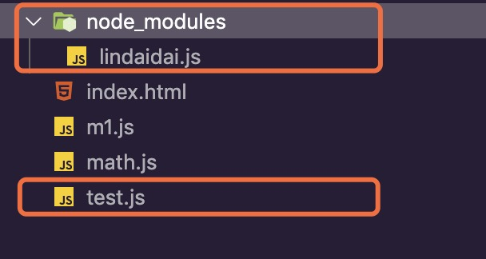

## CommonJS和ES6Modules规范

### 原始写法

在没有`CommonJS`和`ES6`的时候，我们想要达到模块化的效果可能有这么三种：

#### 1. 一个函数就是一个模块

```html
<script>
  function m1 () {
		// ...
  }
  function m2 () {
    // ...
  }
</script>
```

> 缺点：污染了全局变量，无法保证不会与其它模块发生冲突，而且模块成员之间看不出直接关系。

#### 2. 一个对象就是一个模块

对象写法 为了解决上面的缺点，可以把模块写成一个对象，所有的模块成员都放到这个对象里面。

**index.html**

```html
<script>
  var module1 = new Object({
    _sum: 0,
    foo1: function () {},
    foo2: function () {}
  })
</script>
```

> 缺点：会暴露所有模块成员，内部的状态可能被改写。

例如，我们如果只是想暴露出两个方法而不暴露出`_sum`，就做不到。

而此时，`_sum`可能被外部改写：

```javascript
module1._sum = 2;
```

#### 3. 立即执行函数为一个模块

```html
<script>
  var module1 = (function() {
  	var _sum = 0;
    var foo1 = function () {};
    var foo2 = function () {};
    return {
      foo1: foo1,
      foo2: foo2
    }
  })();
</script>
```

利用立即执行函数内的作用域已经闭包来实现模块功能，导出我们想要导出的成员。

此时外部代码就不能读取到`_sum`了：

```javascript
console.log(module1._sum) // undefined
```


### CommonJS规范

这里不做具体的介绍了，我只把一些重要的知识点以及混淆点例举出来。

主要是从这三个方面说：

- 暴露模块
- 引用模块
- 模块标识符

#### 1. 暴露模块

**正确的暴露方式：**

暴露模块有两种方式：

- `module.exports = {}`
- `exports.xxx = 'xxx'`

例如有一个`m1.js`文件：

第一种暴露方式：

```javascript
module.exports = {
	name: 'lindaidai',
  sex: 'body'
}
```

第二种暴露方式：

```javascript
exports.name = 'lindaidai';
exports.sex = 'body'
```

为什么可以有这两种写法呢？

我是这样理解的：`module`这个变量它代表的就是整个模块，也就是`m1.js`。而其实这个`module`变量是有一个属性`exports`的，它是一个叫做`exports`变量的引用，我们可以写一下伪代码：

```javascript
var exports = {};
var module = {
	exports: exports
}
return module.exports
```

(当然这只是伪代码啊，实际你这么去用会发现没有效果)

最后导出的是`module.exports`，而不是`exports`。

**容易混淆的暴露方式：**

如果你在代码中试图`exports = { name: 'lindaidai' }`，你会发现在引入的地方根本获取不到`name`属性。

```javascript
// m1.js
exports = {
	name: 'lindaidai'
}
```

```javascript
// test.js
const math = require('./m1.js')

console.log(m1); // {}
```

在控制台执行`node test.js`，发现打印出来的`m1`是一个空的对象。

我是这样理解的：整个模块的导出是靠`module.exports`的，如果你重新对整个`exports`对象赋值的话，它和`module.exports`就不是同一个对象了，因为它们指向的引用地址都不同：

```javascript
module.exports -> {} // 指向一个空的对象
exports -> { name: 'lindaidai' } // 指向的是另一个对象
```

所以你对`exports = {}`做任何操作都影响不到`module.exports`。

让我们来看几个正确和错误的示例吧：

```javascript
// m1.js
// 1. 正确
module.exports = {
	name: 'lindaidai',
  sex: 'body'
}

// 2. 正确
exports.name = 'lindaidai';
exports.sex = 'body'

// 3. 正确
module.exports.name = 'lindaidai';
module.exports.sex = 'body'

// 4. 无效
exports = {
	name: 'lindaidai',
  sex: 'body'
}
```

可以看到

- `exports.name = xxx`是`module.exports.name = xxx`的缩写。
- `exports = {}`确不是`module.exports = {}`的缩写。

#### 2. 引用模块

对于模块的引用使用全局方法`require()`就可以了。

注意⚠️这个全局方法是`node`中的方法哈，它不是`window`下面的，所以如果你没做任何处理想直接在`html`里用肯定就是不行的了：

**index.html**:

```html
<body>
	<script>
		const m1 = require('./m1.js')
    console.log(m1);
	</script>
</body>
```

例如上面👆这样你打开页面控制台肯定就报错了：

```
Uncaught ReferenceError: require is not defined
	at index.html:11
```

而如果你是在另一个`js`文件中引用(例如`test.js`)，并在终端执行`node test.js`是可以用的：

**test.js**:

```javascript
const m1 = require('./m1.js')

console.log(m1);
```

那是因为你的电脑上全局安装了`Node.js`，所以可以这样玩。

**所以我们可以发现`require()`它是`Node.js`中的一个全局方法，并不是CommonJS独有的，CommonJS只是众多规范中的其中一种。**

这种规范允许我们：

- 使用`module.exports = {}`或者`exports.name = xxx`导出模块
- 使用`const m1 = require('./m1')`引入模块


#### 3. 模块标识符

模块标识符其实就是你在引入模块时调用`require()`函数的参数。

你会看到我们经常会有这样的用法：

```javascript
// 直接导入
const path = require('path');
// 相对路径
const m1 = require('./m1.js');
// 直接导入
const lodash = require('lodash');
```

这其实是因为我们引入的模块会有不同的分类，像`path`这种它是`Node.js`就自带的模块，`m1`是路径模块，`lodash`是我们使用`npm i lodash`下载到`node_modules`里的模块。

分为以下三种：

- 核心模块(`Node.js`自带的模块)
- 路径模块(相对或绝对定位开始的模块)
- 自定义模块(`node_modules`里的模块)

三种模块的查找方式：

- 核心模块，直接跳过路径分析和文件定位
- 路径模块，直接得出相对路径就好了
- 自定义模块，先在当前目录的`node_modules`里找这个模块，如果没有，它会往上一级目录查找，查找上一级的`node_modules`，依次往上，直到根目录下都没有, 就抛出错误。

**自定义模块的查找过程：**

这个过程其实也叫做**路径分析**。

现在我把刚刚的`test.js`来改一下：

```javascript
// const m1 = require('./m1.js');

// console.log(m1);
console.log(module.paths)
```

然后在终端执行：

```
node test.js
```

会发现输出了下面的一个数组：

```javascript
LinDaiDaideMBP:commonJS lindaidai$ node test.js
[
  '/Users/lindaidai/codes/test/CommonJS和ES6/commonJS/node_modules',
  '/Users/lindaidai/codes/test/CommonJS和ES6/node_modules',
  '/Users/lindaidai/codes/test/node_modules',
  '/Users/lindaidai/codes/node_modules',
  '/Users/lindaidai/node_modules',
  '/Users/node_modules',
  '/node_modules'
]
```

这里所说的查找，是指查找你现在用的这个模块，我现在用的是`test.js`，你可能看不出什么效果。现在让我们来模拟一个我们使用`npm i`安装的一个自定义模块功能。

首先，我在根目录下新建了一个名叫`node_modules`的文件夹，并在其中新建了一个名叫`lindaidai.js`的文件，用来模拟一个`npm`安装的依赖。

目录结构：



稍微编写一下`lindaidai.js`:

```javascript
module.exports = {
  print: function () {
    console.log('lindaidai')
  }
}
console.log('lindaidai模块：', module.paths)
```

然后在`test.js`中引入这个`lindaidai`模块:

```javascript
// const m1 = require('./m1.js');
// console.log(m1);
// console.log(module.paths)

const lindaidai = require('lindaidai');
lindaidai.print();
```

现在执行`node test.js`，会发现输出了：

```javascript
LinDaiDaideMBP:commonJS lindaidai$ node test.js
lindaidai模块： [
  '/Users/lindaidai/codes/test/CommonJS和ES6/commonJS/node_modules',
  '/Users/lindaidai/codes/test/CommonJS和ES6/node_modules',
  '/Users/lindaidai/codes/test/node_modules',
  '/Users/lindaidai/codes/node_modules',
  '/Users/lindaidai/node_modules',
  '/Users/node_modules',
  '/node_modules'
]
lindaidai
```

所以现在你可以知道，平常我们使用这种依赖的时候，它是怎样的一个查找顺序了吧，它其实就是按照自定义模块的顺序来进行查找。

**文件定位：**

上面👆已经介绍完了路径分析，但是还有一个问题，就是我们导入的模块它的后缀(扩展名)是可以省略的啊，那`Node`怎么知道我们是导入了一个`js`还是一个`json`呢？这其实就涉及到了文件定位。

在NodeJS中, 省略了扩展名的文件, 会依次补充上.js, .node, .json来尝试, 如果传入的是一个目录, 那么NodeJS会把它当成一个包来看待, 会采用以下方式确定文件名

第一步, 找出目录下的package.json, 用JSON.parse()解析出main字段

第二步, 如果main字段指定的文件还是省略了扩展, 那么会依次补充.js, .node, .json尝试.

第三部, 如果main字段制定的文件不存在, 或者根本就不存在package.json, 那么会默认加载这个目录下的index.js, index.node, index.json文件.

以上就是文件定位的过程, 再搭配上路径分析的过程, 进行排列组合, 这得有多少种可能呀. 所以说, 自定义模块的引入, 是最费性能的.

(来源：https://zhuanlan.zhihu.com/p/27644026)


### AMD规范

#### 1. 产生原因

上面介绍的`CommonJS`规范看起来挺好用的啊，为什么又还要有其它的规范呢？比如`AMD、CMD`，那它们和`CommonJS`又有什么渊源呢？

我们知道，模块化这种概念不仅仅适用于服务器端，客户端同样也适用。

而`CommonJS`规范就不太适合用在客户端(浏览器)环境了，比如上面的那个例子，也就是:

**test.js**:

```javascript
const m1 = require('./m1.js')
console.log(m1);

// 与m1模块无关的一些代码
function other () {}
other();
```

这段代码放在浏览器环境中，它会如何运行呢？

- 首先加载`m1.js`
- 等`m1.js`加载完毕之后才执行后面的内容

后面的内容要等待`m1`加载完才会执行，如果`m1`加载的很慢呢？那不就照成了卡顿，这对于客户端来说肯定是不友好的。像这种要等待上一个加载完才执行后面内容的情况我们可以叫做`"同步加载"`，很显然，这里我们更希望的是`other()`的执行不需要等`m1`加载完才执行，也就是我们希望`m1`它是`"异步加载"`的，这也就是`AMD`。

在介绍`AMD`之前让我们看看`CommonJS`规范对服务器端和浏览器的不同，它有助于让你理解为什么说`CommonJS`不太适合于客户端：

- 服务器端所有的模块都存放在本地硬盘中，可以同步加载完成，等待时间就是硬盘的读取时间。
- 浏览器，所有的模块都放在服务器端，等待时间取决于网速的快慢，可能要等很长时间，浏览器处于”假死”状态。

#### 2. 定义并暴露模块

有了上面这层背景，我们就知道了，`AMD`它的产生很大一部分原因就是为了能让我们采用**异步的方式加载模块**。

所以现在来让我们看看它的介绍吧。

`AMD`是`Asynchronous Module Definition`的缩写，也就是`"异步模块定义"`。（前面的`A`就很好记了，它让我不自觉的就想到`async`这个定义异步函数的修饰符）

> 它采用异步方式加载模块，模块的加载不影响它后面语句的运行。所有依赖这个模块的语句，都定义在一个回调函数中，等到加载完成之后，这个回调函数才会运行。

此时就需要另一个重要的方法来定义我们的模块了：`define()`。

它其实是会有三个参数：

```javascript
define(id?, dependencies?, factory)
```

- id: 一个字符串，表示模块的名称，但是是可选的
- dependencies: 一个数组，是我们当前定义的模块要依赖于哪些模块，数组中的每一项表示的是要依赖模块的相对路径，且这个参数也是可选的
- factory: 工厂方法，一个函数，这里面就是具体的模块内容了

来看个小例子，我重新定义了一个`math.js`：

**math.js**

```

```

