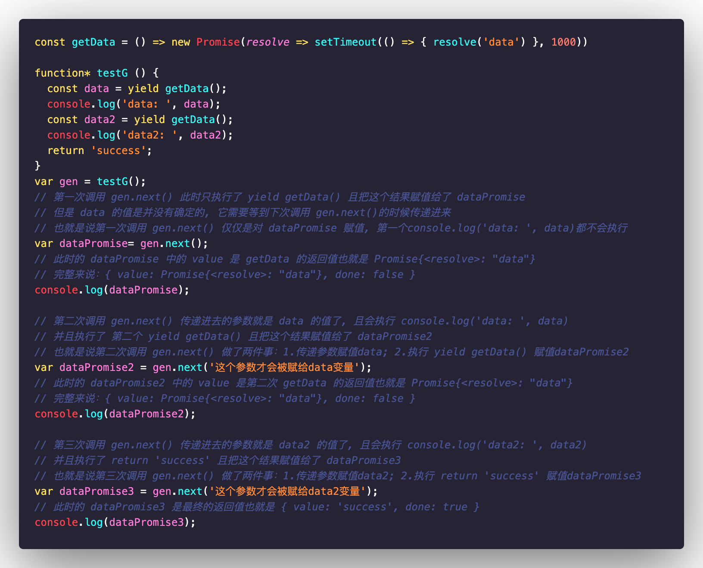

## 手写async函数及原理

## 前言

你盼世界，我盼望你无`bug`。Hello 大家好！我是霖呆呆！

其实本文怎么说呢，算不上是呆呆的纯原创吧，因为呆呆也是参考晨曦老哥的[手写async await的最简实现（20行）](https://juejin.im/post/5e79e841f265da5726612b6e)来写的，包括案例啥的也是一样，而且参考的这篇文章，对手写`async`函数说的也很清楚了。不过呆呆主要是在其中加上了一些自己的理解以及更加详细的转换过程，也算是自己的一个学习笔记吧。

所以如果您在看完呆呆写的这篇文章后，还希望可以再看一遍晨曦哥的原创，这样对您的帮助应该会更大。

(另外如果您觉得呆呆写的还不错的话还希望可以给本篇和原创都点一个赞，毕竟呆呆也是借鉴的晨曦哥的，内心有愧...啊啊啊...为什么感觉我是真的臭不要脸，哪有求人家赞还带送一个赞的😂)


## 正文

`ES8`推出的`async/await`允许我们用更加优雅的方式来实现异步代码，从某种角度上来说，它是`Generator`函数的语法糖，就像我们经常说`class`是构造函数的语法糖一样。


### async案例

基本用法啥的我就不说了，这里直接上一个简单的案例，后面一步步的转换过程都是以此案例作为基础。

```javascript
const getData = () => new Promise(resolve => setTimeout(() => { resolve('data') }, 1000))

async function test () {
  const data = await getData();
  console.log('data: ', data);
  const data2 = await getData();
  console.log('data2: ', data2);
  return 'success';
}
test().then(res => console.log(res));
```

针对于上面的这段代码，相信大家都没有什么疑问，很快我们就能说出答案：

```javascript
// 1s 后打印出
'data ' 'data'
// 1s 后打印出
'data2: ' 'data'
'success'
```


### Generator案例

让我们先来回顾一下`Generator`最基本的一些概念：

- `function`后面加上`*`表示这是一个`Generator`函数，如`function* testG(){}`
- 函数内部可以使用`yield`来中断函数的执行，即当每次执行到`yield`语句的时候，函数暂停执行
- 暂停执行之后，需要调用`next()`才会继续执行`Generator`函数，直到碰到函数内下一个`yield`又会暂停
- 以此循环，直到函数内有`return`或者函数内代码全部执行完

其中还有很重要的一个知识点，就是每次调用`next()`的返回值，它是一个对象，这个对象会有两个属性：

- `value`：`yield`语句后的表达式的结果
- `done`：当前的`Generator`对象的逻辑块是否执行完成

如果说我们把上面的案例转换为`Generator`来实现的话，我们想的可能会是这样来写：

*案例一：*

```javascript
const getData = () => new Promise(resolve => setTimeout(() => { resolve('data') }, 1000))

function* testG () {
  const data = yield getData();
  console.log('data: ', data);
  const data2 = yield getData();
  console.log('data2: ', data2);
  return 'success';
}
var gen = testG();
// 之后手动调用3次
gen.next();
gen.next();
gen.next();
```

可是上面👆的代码真的会和`async`案例中的执行结果一样吗？

当我打开控制台的时候，结果却出乎我的意料：

```
data: undefined
data2: undefined
```

What...?

你的`suceess`没有打印就算了，你的`data`和`data2`竟然都还是`undefined`？这就有点难以理解了。

难道说是我的调用姿势不对吗...

本着良好的职业素养，我对`Generator`研究了一波，然后修改了一下上面的代码：

*案例二：*

```javascript
const getData = () => new Promise(resolve => setTimeout(() => { resolve('data') }, 1000))

function* testG () {
  const data = yield getData();
  console.log('data: ', data);
  const data2 = yield getData();
  console.log('data2: ', data2);
  return 'success';
}
var gen = testG();
// 手动调用3次且把每次的返回值打印出来看看
var dataPromise= gen.next();
console.log(dataPromise);
var dataPromise2 = gen.next('这个参数才会被赋给data变量');
console.log(dataPromise2);
var dataPromise3 = gen.next('这个参数才会被赋给data2变量');
console.log(dataPromise3);
```

可以看到不同之处在于我把调用三次的返回值用了一个变量来盛放，并且在后面两次调用`gen.next()`的时候传递了参数进去。

现在的输出结果为：

```javascript
{value: Promise, done: false}
'data:', '这个参数才会被赋给data变量'
{value: Promise, done: false}
'data2:', '这个参数才会被赋给data2变量'
{value: Promise, done: false}
```

What X 2...?

哈哈哈，是不是有点摸不着头脑了，这`data`和`data2`的返回值难道不是`yield getData()`的结果吗？

我这里的代码明明就是`const data = yield getData()`呀，可是怎么会变成了`'这个参数才会被赋给data变量'`呢？

原来有些的你以为并不是真的你以为，呆呆这里详细把每一步都分析一下：




OK👌，相信聪明的你现在一定弄懂`Generator`的执行机制了，它和我们的`async`函数是有一些区别的。

在`async`函数中，`const data = await getData()`，这个`data`是`getData()`中`resolve()`的结果。

而`generator`函数中，`const data = yield getData()`，其实只执行了`yield getData()`函数而已并且会把这个值作为第一次调用`gen.next()`的返回值，也就是被`dataPromise`所接收。

`data`需要等到下一次调用`gen.next()`时才会被赋值，这也就是为什么我们在案例一中`data`会是`undefined`，因为那时候我们调用`gen.next()`是没有传递任何参数的。


### Generator案例转换async案例

显然，上面👆两个案例的执行结果和`async`案例中的结果是不一样的，我只是将其做了一些拆分以便让你更好的理解接下来我要做的事情。

嘻嘻😁，那么如何让案例二能打印出和`async`案例一样的结果呢？

细心的小伙伴可能已经有了一些想法，`dataPromise`中会有调用返回的`Promise`对象，那么我们也就能拿到这个`Promise`的返回值`'data'`了，只需要使用`.then()`来进行一个链式调用，就像下面这样：

```javascript
const getData = () => new Promise(resolve => setTimeout(() => { resolve('data') }, 1000))

function* testG () {
  const data = yield getData();
  console.log('data: ', data);
  const data2 = yield getData();
  console.log('data2: ', data2);
  return 'success';
}
var gen = testG();
var dataPromise = gen.next();
dataPromise.value.then((value1) => {
  var dataPromise2 = gen.next(value1);
  dataPromise2.value.then((value2) => {
    var dataPromise3 = gen.next(value2)
    console.log(dataPromise3.value)
  })
})
```

现在的结果就是和`async`案例的结果一样咯：

（如果你对这道题的结果还是比较模糊的话请再仔细看一下我在案例二的那一大坨代码注释哦）

```javascript
// 1s 后打印出
'data ' 'data'
// 1s 后打印出
'data2: ' 'data'
'success'
```

（注意⚠️，在每次调用`gen.next()`的时候，它的返回值是一个`{ value: {}, done: false }`这样的对象，所以我们想要使用返回的`Promise`的时候，需要用`dataPromise.value`来获取）


### throw()

在正式讲解之前，让我们再来认识一下`Generator`的另一个实例方法`throw()`，之所以说到它，是因为我们最终的代码需要用到它。

它和`next()`一样，都是属于`Generator.prototype`上的方法，且返回值也是和`next()`一样。

让我们来看一个简单的案例了解一下它是怎样使用的哈：

(利用`while(true){}`循环，我们创建了一个可以无限调用的`Generator`函数)

```javascript
function* gen () {
  while (true) {
    try {
      yield 'LinDaiDai'
    } catch (e) {
      console.log(e)
    }
  }
}
var g = gen();
g.next(); // { value: 'LinDaiDai', done: false }
g.next(); // { value: 'LinDaiDai', done: false }
g.throw(new Error('错误')); // Error: '错误'
```

而且你会发现，并不是`throw`中一定要传一个`new Error()`才会被里面的`catch`捕获，你就算是传递一个别的类型的值进去，也会，例如我直接传递字符串`'错误'`:

```javascript
g.throw('错误'); // '错误'
```

它也会被捕获。


### Generator实现async?

我们在搞懂了`Generator`的执行机制之后，就可以来看看，`async`是怎样用`Generator`来实现的了。

首先，让我们确定一下我们要做的事情：

```javascript
const getData = () => new Promise(resolve => setTimeout(() => { resolve('data') }, 1000))

function* testG () { // 这个就是上面的那个案例
  const data = yield getData();
  console.log('data: ', data);
  const data2 = yield getData();
  console.log('data2: ', data2);
  return 'success';
}

// 我们需要设计一个转换函数
function asyncToGenerator (genFunc) {}

var test = asyncToGenerator(testG);
test().then(res => console.log(res));
```

那么可以看到，现在的关键就是在于实现一个`asyncToGenerator`转换函数，它有以下特点：

- 接收一个`Generator`函数
- 返回一个`Promise`

而`Generator`你们也看到了，它是很懒的，需要我们每调用一次`next()`函数它才走一步，所以如何让它自动的执行成为了我们需要思考的点。

呆呆这里也不再小气了，直接上晨曦老哥的代码再进行讲解吧：

```javascript
function asyncToGenerator (genFunc) {
  return function () {
    const gen = genFunc.apply(this, arguments);
    return new Promise((resolve, reject) => {
      function step (key, arg) {
        let generatorResult;
        try {
          generatorResult = gen[key](arg);
        } catch (err) {
          return reject(err);
        }
        const { value, done } = generatorResult;
        if (done) {
          return resolve(value);
        } else {
          return Promise.resolve(value).then(val => {
            step("next", val)
          }, err => {
            step("throw", err)
          })
        }
      }
      step("next")
    })
  }
}
var gen = asyncToGenerator(testG)
gen().then(res => console.log(res))
```

怎么样？是不是觉得晨曦老哥很短啊，呸，写的很精简呀 😄。

如果觉得有点吃力的话没关系，呆呆会将每一步仔细拆分着说。


#### 1. 整体结构

让我们来设想一下`asyncToGenerator`的大概样子了，它也许是长这样的：

```javascript
function asyncToGenerator (genFunc) {
	return function () {
		return new Promise((resolve, reject) => {})
	}
}
```

依照要求，接收一个`Generator`函数，返回一个`Promise`，上面这种结构是完全满足的。可是如果是想要返回`Promise`的话，为什么还要把它包到一个函数里面呢，不应该是这样写吗：

```javascript
function asyncToGenerator (genFunc) {
	return new Promise((resolve, reject) => {})
}
```

唔...这样写固然也可以，不过别忘了我们的调用方式：

```javascript
var test = asyncToGenerator(testG);
test().then(res => console.log(res));
```

我们一般是会把`asyncToGenerator`的返回值用一个变量来盛放的，所以如果你不包到函数里的话，就只能这样调用了：

```javascript
asyncToGenerator(testG).then(res => console.log(res))
```

这显然不是我们想要的。


#### 2. 如何保证自动调用

有了`asyncToGenerator`函数的整体结构之后我们就要开始考虑如何让它自动调用这一个个的`next()`呢？

咦～你是不是想到了什么？

递归？

嘻嘻😁，确实像这种需要循环调用的时候确实容易让人想到递归，这里其实也是可以的。

所以现在我们就得先确定递归的终止条件是什么。

在`Generator`函数中，什么情况才算是该对象的逻辑代码执行完了呢？这个其实前面也已经提到了，当`返回的done属性为true`时就可以确定已经执行完了，递归也该结束了。

知道了终止的条件之后，我们就需要把整个递归结束，结合上面👆我们已经设计好的整体结构，这其实很简单，直接`return`一个`resolve()`或者`reject()`就可以做到：

```javascript
function asyncToGenerator (genFunc) {
	return function () {
		return new Promise((resolve, reject) => {
      // 终止条件满足时,直接调用reject()来退出, value为最终的值(后面会说到)
      return resolve(value);
      // 或者 return reject(error);
    })
	}
}
```

OK👌，终止条件和怎么终止都已经知道了，让我们接着往下看。

在这里，我们可以写一个`step`函数，然后配合`Promise.resolve()`来实现循环调用，类似于这样：

```javascript
function asyncToGenerator (genFunc) {
	return function () {
		return new Promise((resolve, reject) => {
      function step () {
        return Promise.resolve(value).then(val => {
          step()
        })
      }
      step();
    })
	}
}
```

所以这时候我们就得看看`Promise.resolve(value)`中的`value`是哪来的了，它实际上是我们在每次调用`gen.next()`返回值中的`value`，对应着案例二的代码：

```javascript
yield getData()

// 也就是 getData()的返回值
// 也就是 Promise{<resolve>, 'data'}
```

所以此时我们的代码就变成了这样：

```diff
function asyncToGenerator (genFunc) {
	return function () {
+   const gen = genFunc.apply(this, arguments);
		return new Promise((resolve, reject) => {
      function step () {
+        let generatorResult = gen.next();
+        const { value, done } = generatorResult;
+        if (done) {
+          return resolve(value);
+        } else {
          return Promise.resolve(value).then(val => {
          	step()
        	})
+        }
      }
      step();
    })
	}
}
```

这段代码我加上了两个功能：

1. `const gen = getFunc.apply(this, arguments)`来实现类似`const gen = testG()`这样的代码，是为了先调用`generator`函数来生成迭代器。
2. 在`setp`中调用了`gen.next()`，并保存结果到`generatorResult`上，同时判断终止条件`done`。


#### 3. 传值以及异常处理

OK👌，完成了上述步骤后，显然还是不够的，我们至少还有两点没有考虑到：

- 没有把调用`gen.next()`的结果传递给后面的`gen.next()`
- 没有对异常情况作处理

首先，前面也提到了，`next()`和`throw()`调用时的返回值都是这样的格式：

```javascript
{ value: {}, done: false }
```

那我们是不是就可以把这两个方法名当成一个参数传递到下一个`step`中呢？

而每次`Promise.resolve(value)`这里的结果我们也可以把它当成参数传递到下一个`step`中。

所以现在再让我们来看看最终的代码：

```javascript
function asyncToGenerator (genFunc) {
  return function () {
    const gen = genFunc.apply(this, arguments);
    return new Promise((resolve, reject) => {
      function step (key, arg) {
        let generatorResult;
        try {
          generatorResult = gen[key](arg);
        } catch (err) {
          return reject(err);
        }
        const { value, done } = generatorResult;
        if (done) {
          return resolve(value);
        } else {
          return Promise.resolve(value).then(val => {
            step("next", val)
          }, err => {
            step("throw", err)
          })
        }
      }
      step("next")
    })
  }
}
var gen = asyncToGenerator(testG)
gen().then(res => console.log(res))
```

新加的代码主要做了这么几件事：

1. `step`函数增加两个字段：`key`为方法名(`next`或者`throw`)；`arg`为上一次`gen[key]()`的
2. 使用`try/catch`来捕获执行`gen[key](arg)`时的异常
3. `.then()`中增加第二个参数来捕获异常

这里需要注意的一点是，`Promise.resolve(value)`中的`value`它是一个`Promise`，为什么呢？

让我们来看看`generatorResult`：

```javascript
{ value: Promise{<resolve>, 'data'}, done: false }
```

对应着案例二，其实也就是`yield getData()`这段语句中`getData()`返回的那个`Promise`。

而下一个`step("next")`必须等`value`这个`Promise`被`resolve`的时候才会被调用。


## 参考文章

- [手写async await的最简实现（20行）](https://juejin.im/post/5e79e841f265da5726612b6e)


## 后语

你盼世界，我盼望你无`bug`。这篇文章就介绍到这里。

OK👌，情况就是这么一个情况，在我们弄懂这一步一步的原理之后再来记就不难了 😄。

