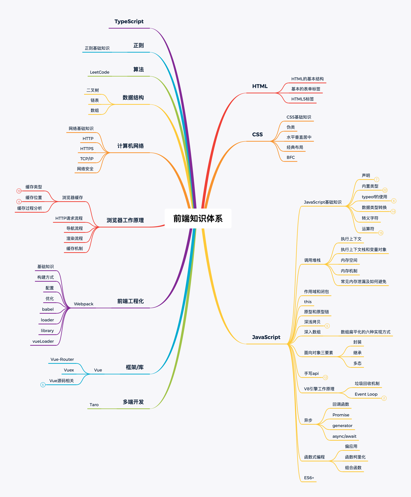

# 霖呆呆的知识体系

这是一份自我认知自我追求的清单，在一段时间内我会依照清单上的内容弥补自己的不足。

还请和我一起，盼望看到我们共同的成长。

### 文章目录

### 2020面试系列

- [霖呆呆的近期面试128题汇总(不含答案)](./2020面试系列/霖呆呆的近期面试128题汇总(不含答案).md)
- [霖呆呆的近期面试128题汇总(含超详细答案)-掘金链接](https://juejin.im/post/5eb55ceb6fb9a0436748297d)
- [霖呆呆的近期中大厂面试汇总(不含答案)](./2020面试系列/霖呆呆的近期中大厂面试汇总(不含答案).md)
- [霖呆呆的中大厂面试记录及2年前端薪资对比(附赠学习方法)-掘金链接](https://juejin.im/post/5eda38ebf265da7700281d57)
- [霖呆呆的近期中大厂面试汇总(含超详细答案)](./2020面试系列/霖呆呆的近期中大厂面试汇总(含超详细答案).md)

### DD每周前端七题详解系列

- [系列目录](./DD每周前端七题详解/README.md)

### HTML

- [HTML的基本结构](./HTML/HTML的基本结构.md)
- [基本的表单标签](./HTML/基本的表单标签.md)
- [DOM基础](./HTML/DOM基础.md)
- HTML5标签

### CSS

- [CSS的基础知识](./CSS/CSS的基础知识.md)
- [伪类](./CSS/伪类.md)
- 水平垂直居中
- 经典布局
- [BFC](./CSS/BFC.md)
- [【问】position-fixed什么时候会失效](./CSS/position-fixed什么时候会失效.md)
- [用CSS实现各种形状](./CSS/用CSS实现各种形状.md)

### JavaScript

#### JavaScript基础知识

- [JS基础知识](./JavaScript/JavaScript基础知识/JS基础知识.md)

#### 数据类型转换

- [【精】从206个console.log()完全弄懂数据类型转换的前世今生(上)](./JavaScript/数据类型转换/从206个console.log()完全弄懂数据类型转换的前世今生(上).md)

- [【精】从206个console.log()完全弄懂数据类型转换的前世今生(下)](./JavaScript/数据类型转换/从206个console.log()完全弄懂数据类型转换的前世今生(下).md)

#### 调用堆栈

- [JavaScript进阶-执行上下文](./JavaScript/调用堆栈/JavaScript进阶-执行上下文.md)

- [JavaScript进阶-执行上下文栈和变量对象](./JavaScript/调用堆栈/JavaScript进阶-执行上下文栈和变量对象.md)

- [JavaScript进阶-内存空间](./JavaScript/调用堆栈/JavaScript进阶-内存空间.md)

- [JavaScript进阶-内存机制](./JavaScript/调用堆栈/JavaScript进阶-内存机制.md)

- [JavaScript进阶-常见内存泄露及如何避免](./JavaScript/调用堆栈/JavaScript进阶-常见内存泄露及如何避免.md)
- [记录一次定时器及闭包问题造成的内存泄漏](./JavaScript/调用堆栈/记录一次定时器及闭包问题造成的内存泄漏.md)

#### 作用域和闭包

#### this

- [【建议点赞】再来40道this面试题酸爽继续](./JavaScript/this/再来40道this面试题酸爽继续.md)

#### 原型和原型链

- [原型到底是个啥](./JavaScript/原型和原型链/原型到底是个啥.md)

#### 深浅拷贝

- [深浅拷贝问点](./JavaScript/深浅拷贝/深浅拷贝问点.md)

#### 深入数组

- [数组扁平化的六种实现方式](./JavaScript/深入数组/数组扁平化的六种实现方式.md)

#### 面向对象三要素

- [封装](./JavaScript/面向对象三要素/比继承家业还要简单的JS继承题-封装篇(牛刀小试).md)
- [继承](./JavaScript/面向对象三要素/做完这48道题彻底弄懂JS继承(1.7w字含辛整理-返璞归真).md)
- [多态](./JavaScript/面向对象三要素/JS面向对象最后一弹-多态篇(羽化升仙).md)

#### 手写api

- [你真的能完全运用好防抖节流吗](./JavaScript/手写api/你真的能完全运用好防抖节流吗.md)

#### V8引擎工作原理

- [垃圾回收机制](./JavaScript/调用堆栈/JavaScript进阶-内存机制.md)
- EventLoop

#### 异步

- [【建议星星】要就来45道Promise面试题一次爽到底](./JavaScript/异步/要就来45道Promise面试题一次爽到底.md)
- generator
- [这篇手写async函数及原理](./JavaScript/异步/这篇手写async函数及原理.md)

#### ES6+

- [Javascript之ES7详解](./JavaScript/ES6+/Javascript之ES7详解.md)
- [ES9已经来了 Are you ready](./JavaScript/ES6+/ES9已经来了AreYouReady.md)
- [一篇不是标题党的CommonJS和ES6模块规范讲解](./JavaScript/ES6+/一篇不是标题党的CommonJS和ES6模块规范讲解.md)

#### 函数式编程

- [霖呆呆的函数式编程之路(一)-高阶函数](./JavaScript/函数式编程/霖呆呆的函数式编程之路(一)-高阶函数.md)
- [霖呆呆的函数式编程之路(二)-偏函数和柯里化](./JavaScript/函数式编程/霖呆呆的函数式编程之路(二)-偏函数和柯里化.md)
- [霖呆呆的函数式编程之路(三)-进阶柯里化](./JavaScript/函数式编程/霖呆呆的函数式编程之路(三)-进阶柯里化.md)
- [霖呆呆的函数式编程之路(四)-组合函数](./JavaScript/函数式编程/霖呆呆的函数式编程之路(四)-组合函数.md)

#### 总结类

- [读《三元-JS灵魂之问》总结,给自己的一份原生JS补给(上)](./总结类/读《三元-JS灵魂之问》总结,给自己的一份原生JS补给(上).md)

### TypeScript

### 框架-库

#### Vue

- [vuejs源码-模版编译原理](./框架-库/Vue/vuejs源码-模版编译原理.md)
- [vue中一些容易被忽视的使用技巧总结](./框架-库/Vue/vue中一些容易被忽视的使用技巧总结.md)
- [vue-cli3打包之后的文件为何不能本地打开](./框架-库/Vue/vue-cli3打包之后的文件为何不能本地打开.md)
- [Vue面试题整理](./框架-库/Vue/Vue面试题整理.md)

#### React

- [初识React你应该知道的一些点](./框架-库/React/初识React你应该知道的一些点.md)
- [受控和非受控组件真的那么难理解吗？(React实际案例详解)](./框架-库/React/受控和非受控组件真的那么难理解吗.md)
- [HOC真的就那么高级吗？(React实际案例详解)](./框架-库/React/HOC真的就那么高级吗.md)
- 手撸思维导图系列
  - [呆呆带你手撸一个思维导图-基础篇](./框架/库/React/Topic/呆呆带你手撸一个思维导图-基础篇.md)

#### Angular

- [Angular自定义组件-UI组件篇-switch组件](./框架-库/Angular/Angular自定义组件-UI组件篇-switch组件.md)
- [Angular4中自定义管道](./框架-库/Angular/Angular4中自定义管道.md)

### 前端工程化

#### webpack

- [霖呆呆的webpack之路目录](./前端工程化/webpack/README.md)

### 计算机网络

#### Shutdown HTTP系列

- [ShutdownHTTP系列-基础篇(1)](./计算机网络/ShutdownHTTP系列-基础篇(1).md)
- [ShutdownHTTP系列-HTTP请求报文篇(2)](./计算机网络/ShutdownHTTP系列-HTTP请求报文篇(2).md)
- [ShutdownHTTP系列-Cookie篇(3)](./计算机网络/ShutdownHTTP系列-Cookie篇(3).md)
- [ShutdownHTTP系列-HTTPS篇(4)](./计算机网络/ShutdownHTTP系列-HTTPS篇(4).md)
- [HTTPS面试问答](./计算机网络/HTTPS面试问答.md)

#### TCP系列

- [适合初学者的TCP讲解](./计算机网络/适合初学者的TCP讲解.md)

#### 跨域相关

- [JSONP原理及实现](./计算机网络/跨域/JSONP原理及实现.md)
- [CORS原理及实现](./计算机网络/跨域/CORS原理及实现.md)

### 浏览器工作原理

- [霖呆呆你来说说浏览器缓存吧](./浏览器工作原理/霖呆呆你来说说浏览器缓存吧.md)

### 多端开发

### 算法

- [LeetCode算法题](./算法/LeetCode算法题/README.md)

#### 数据结构

- [二叉树](./数据结构/二叉树/README.md)
- [链表](./数据结构/链表/README.md)
- [数组](./数据结构/数组/README.md)

#### 正则

- [正则基础知识](./正则/正则基础知识.md)

### other

#### 博客相关

- [2020希望你能像对待她一样对待程序-掘金年度征文](./other/2020希望你能像对待她一样对待程序-掘金年度征文.md)
- [【金三银四加分项】也许你也应该有一个自己的博客了](./other/【金三银四加分项】也许你也应该有一个自己的博客了.md)
- [你的掘金文章本可以这么炫（博客美化工具一波带走）](./other/你的掘金文章本可以这么炫（博客美化工具一波带走）.md)
- [呆呆和你谈谈入职CVTE一个月的感受](./other/呆呆和你谈谈入职CVTE一个月的感受.md)

#### 图标相关

- [9012年了你还在用单色图标？(iconfont多色图标详解)](./other/9012年了你还在用单色图标？(iconfont多色图标详解).md)
- [微信小程序使用多色图标详解](./other/微信小程序使用多色图标详解.md)

#### 工作相关

- [怎样让后台小哥哥快速对接你的前端页面](./other/怎样让后台小哥哥快速对接你的前端页面.md)
- [前端上传文件及进行文件类型大小限制](./other/前端上传文件及进行文件类型大小限制.md)
- [vue中使用G2问题汇总](./other/vue中使用G2问题汇总.md)
- [NPM-在npm上发布模块](./other/NPM-在npm上发布模块.md)
- [如何解决GitHub图片加载不出来问题](./other/如何解决GitHub图片加载不出来问题.md)
- [数据权限如何控制](./other/数据权限如何控制)

#### 开发工具相关

- [你的vscode本可以这么炫](./other/你的vscode本可以这么炫.md)

#### flutter

- [Flutter入门](./other/Flutter入门.md)

- [配置flutter全局命令-bash- flutter- command not found](./other/配置flutter全局命令-bash.md)

#### bpmnjs

- [全网最详bpmn.js教材github地址](https://github.com/LinDaiDai/bpmn-chinese-document)

## 后语

喜欢**霖呆呆**的小伙还希望可以关注霖呆呆的公众号 `LinDaiDai` 或者扫一扫下面的二维码👇👇👇.

| 公众号二维码                              | 赞赏码                              |
| ----------------------------------------- | ----------------------------------- |
|  |  |

我会不定时的更新一些前端方面的知识内容以及自己的原创文章🎉

你的鼓励就是我持续创作的主要动力 😊

整理文章, 编写案例不易 😂... 

走过路过的各位大佬能否打赏点饭钱呢...

