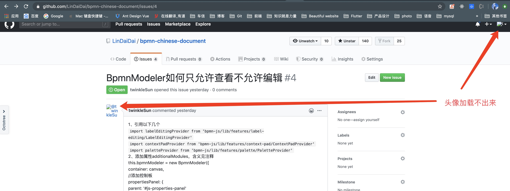
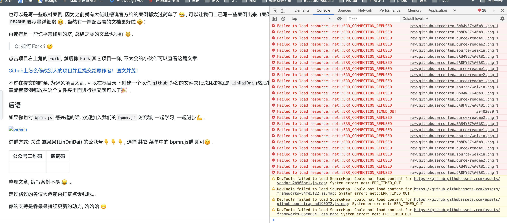
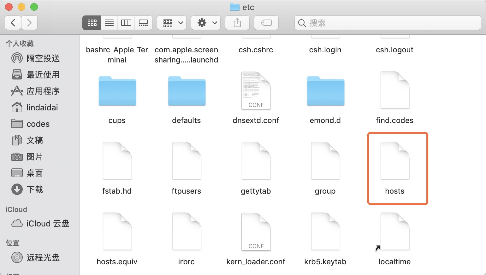
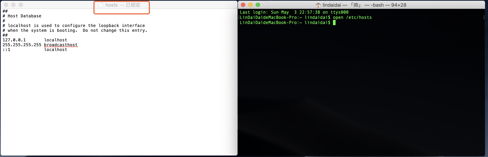
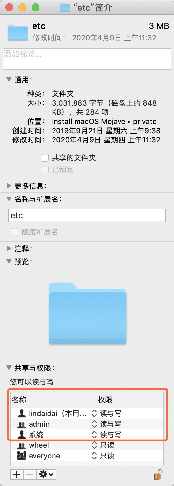
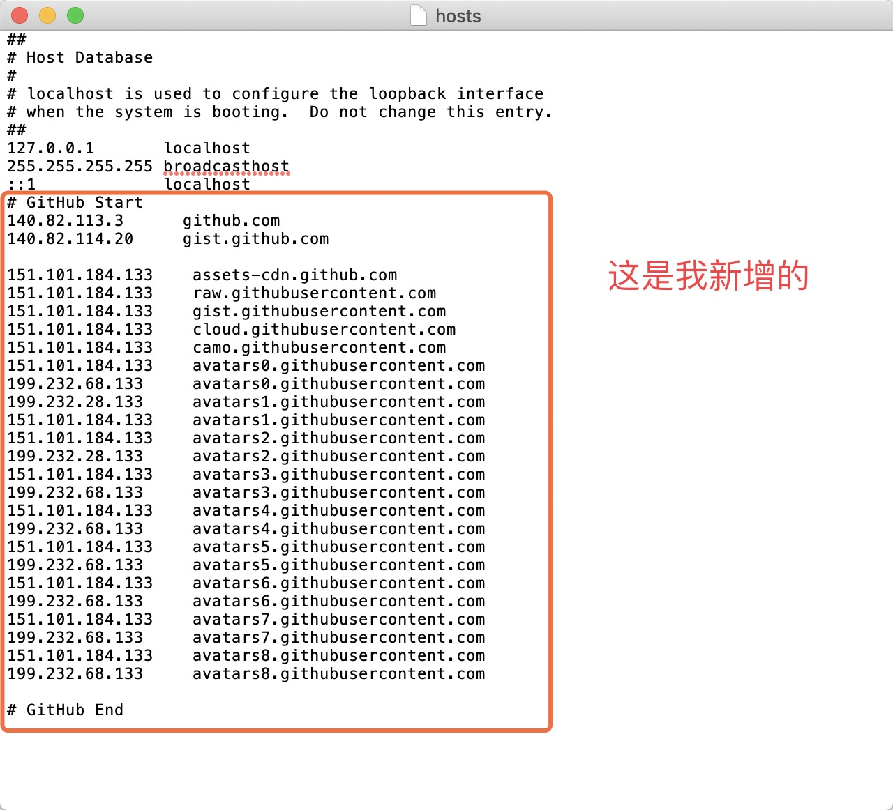

## 如何解决GitHub图片加载不出来问题

### 一、问题描述

很多时候，我们打开`GitHub`查看别人的项目时，会有图片加载不出来的情况，甚至包括用户的头像。如下面两幅图：




此时打开控制台，甚至会看到一大波的错误：



主要思路就是使用本地`hosts`文件对网站进行域名解析，一般的`DNS`问题都可以通过修改`hosts`文件来解决，`github`的`CDN`域名被污染问题也不例外，同样可以通过修改`hosts`文件解决，将域名解析直接指向`IP`地址来绕过`DNS`的解析，以此解决污染问题。

（来源：https://blog.csdn.net/qq_38232598/article/details/91346392）

所以其实不管是`windows`下还是`Mac`下解决的思路都是一样的，都是为了找到`hosts`文件，然后添上`github`的域名`IP`映射。

另外关于查询域名的对应`IP`映射可以到点击这里：https://www.ipaddress.com/


### 二、windows如何解决？

因为博主用的一直都是`Mac`，所以这里偷个懒，来个传送门：

[【最新】解决Github网页上图片显示失败的问题](https://blog.csdn.net/qq_38232598/article/details/91346392)


### 三、Mac如何解决？

这里详细的记录下自己在`Mac`下是如何解决这个问题的。其实之前解决过一次，不过后来换了一次系统，配置文件又变动了，所以这次也是写篇文章总结一下。

#### 1. 查找并打开hosts文件

其实按开头介绍的，解决的关键就是要找到`hosts`这个文件。

打开达访，然后使用`快速查找`快捷键：

```
Shift + Command + G
```

输入：

（我电脑中的这个文件是放在这个目录下的，但是我不是很确定你们的是不是也是）

```
private/etc/
```

回车，进入这个文件夹中，可以找到`hosts`这个文件。



如果你不确定自己的`host`文件在哪里，你可以这样做：

一、打开终端

`Command + 空格`

输入`terminal`并回车

二、打开`hosts`文件

在终端中输入：

```
$ open /etc/hosts
```

并回车，此时会打开`hosts`文件。




#### 2. 修改etc文件夹权限

如上面那种图所示，你打开的hosts文件不一定能够编辑，也就是在文件名的边上显示的是已锁定。

这时候我们需要修改一下这个文件夹的权限，也就是`etc`文件夹的权限。

**一、**

首先进入`private`文件夹下，并右键`etc`文件夹，点击`显示简介`。

**二、**

解锁`hosts`，点击右下脚的解锁按钮:


**三、**

添加修改权限，我这里是将`Admin`和`lindaidai`都添加了进去，并且权限设置为`读与写`。



经过上面几步，你再次打开`hosts`文件就可以进行编辑了。


#### 3. 给hosts中添加github的IP地址

将以下配置添加到你的`hosts`文件中。

(`hosts`文件可以用任意的文本编辑器打开，例如我直接用的`Mac`自带的文本编辑)

```
# GitHub Start 
140.82.113.3      github.com
140.82.114.20     gist.github.com

151.101.184.133    assets-cdn.github.com
151.101.184.133    raw.githubusercontent.com
151.101.184.133    gist.githubusercontent.com
151.101.184.133    cloud.githubusercontent.com
151.101.184.133    camo.githubusercontent.com
151.101.184.133    avatars0.githubusercontent.com
199.232.68.133     avatars0.githubusercontent.com
199.232.28.133     avatars1.githubusercontent.com
151.101.184.133    avatars1.githubusercontent.com
151.101.184.133    avatars2.githubusercontent.com
199.232.28.133     avatars2.githubusercontent.com
151.101.184.133    avatars3.githubusercontent.com
199.232.68.133     avatars3.githubusercontent.com
151.101.184.133    avatars4.githubusercontent.com
199.232.68.133     avatars4.githubusercontent.com
151.101.184.133    avatars5.githubusercontent.com
199.232.68.133     avatars5.githubusercontent.com
151.101.184.133    avatars6.githubusercontent.com
199.232.68.133     avatars6.githubusercontent.com
151.101.184.133    avatars7.githubusercontent.com
199.232.68.133     avatars7.githubusercontent.com
151.101.184.133    avatars8.githubusercontent.com
199.232.68.133     avatars8.githubusercontent.com

# GitHub End
```

如下图：




### 四、解决成功效果

保存成功上诉文件后，让我们重新打开`github`再来看看吧。

good boy~ 完美解决：

