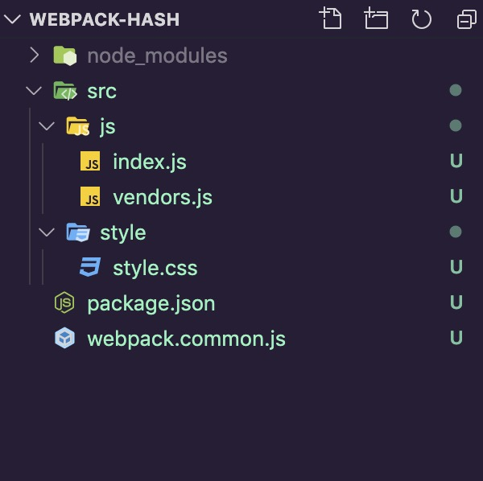

## 霖呆呆的webpack之路-三种hash的区别

### 为什么要使用hash?

一句话来说就是可以配合浏览器缓存带给更佳的用户体验，根据文件来生成对应的`hash`值以此来告诉浏览器要不要读区缓存。


### 前期准备

本篇文章中以下所有的教材案例`GitHub`地址：[LinDaiDai/webpack-example/tree/webpack-hash](https://github.com/LinDaiDai/webpack-example/tree/webpack-hash) **⚠️：请仔细查看README说明)**

为了能更好的查看到效果，我需要准备一个本地的案例项目。

OK👌，让我们快速的构建一个简单的案例：

(不愿意看具体的项目构建细节的小伙伴可以直接跳到下面的项目目录)

```
mkdir webpack-hash && cd webpack-hash

npm init

cnpm i webpack webpack-cli webpack-merge clean-webpack-plugin style-loader css-loader mini-css-extract-plugin --save-dev

touch webpack.common.js

mkdir src && cd src

mkdir js && cd js

touch index.js
touch vendors.js

cd ../

mkdir style && cd style

touch style.css
```

现在整个项目目录变为：



给每个文件里加点东西：

*/src/js/index.js*:

```javascript
console.log('我是index.js')
```

*/src/js/vendors.js*:

```javascript
console.log('我是vendors.js')
```

*/src/style/style.css*:

```css
.container {
  background-color: red;
}
```

同时配置一个公共的`webpack`配置，也就是配置一下`webpack.common.js`文件，以便我们后面用`webpack-merge`来管理不同的`webpack配置`。(不了解`webpack-merge`的小伙伴可以看这里：[霖呆呆向你发起了多人学习webpack-构建方式篇(2)](https://juejin.im/post/5ea2a64a51882573a509c426#heading-10))

*webpack.common.js*:

```javascript
const path = require('path');
const MiniCssExtractPlugin = require('mini-css-extract-plugin');
const { CleanWebpackPlugin } = require("clean-webpack-plugin");

module.exports = {
  entry: {
    index: ["./src/js/index.js", "./src/style/style.css"],
    vendors: ["./src/js/vendors.js"]
  },
  plugins: [
    new CleanWebpackPlugin(),
  ],
  module: {
    rules: [
      {
        test: /\.css$/,
        use: [MiniCssExtractPlugin.loader, 'css-loader']
      }
    ]
  }
}
```

说明：

- 这个配置中暂时没有输出，因为在后面的案例中会演示不同的输出结果
- `clean-webpack-plugin`插件用于每次重新构建能清除上一次的`dist`文件夹
- `mini-css-extract-plugin`插件用于`css`代码分离，这样能够把打包之后的`css`文件提取到一个单独的文件中


### hash

输出的结果全部使用`hash`的情况。

现在我在项目的根目录下再创建一个`webpack.allhash.js`文件用于演示输出的文件名全用`hash`会有什么样的效果。

*webpack.allhash.js*:

```javascript
const path = require('path');
const merge = require('webpack-merge');
const commonConfig = require('./webpack.common');
const MiniCssExtractPlugin = require('mini-css-extract-plugin');

module.exports = merge(commonConfig, {
  output: {
    path: path.resolve(__dirname, 'dist'),
    filename: 'bundle.[name].[hash].js'
  },
  plugins: [
    new MiniCssExtractPlugin({
      filename: 'css/[name].[hash].css'
    })
  ]
})
```

同时在`package.json`中添加一条构建指令：

```json
{
  "scripts": {
    "allhash": "webpack --config webpack.all.hash.js"
  }
}
```

执行指令：`npm run allhash`，生成的结果：

```
Hash: 054de6cd811fc10f7697
Version: webpack 4.43.0
Time: 253ms
Built at: 2020-05-05 11:18:10
                                 Asset        Size  Chunks                         Chunk Names
  bundle.index.054de6cd811fc10f7697.js  1010 bytes       0  [emitted] [immutable]  index
bundle.vendors.054de6cd811fc10f7697.js   996 bytes       1  [emitted] [immutable]  vendors
    css/index.054de6cd811fc10f7697.css    40 bytes       0  [emitted] [immutable]  index
```

会发现`hash`有以下几个特点：

- 每个文件都具有相同的哈希值，因为它`[hash]`是基于我们使用的所有源文件生成的。
- 如果我重新运行该构建而不更改任何内容，则生成的`[hash]`将保持不变。
- 如果我仅编辑一个文件，则`[hash]`值将发生变化，并且所有生成捆绑的名称中都会包含此新`[hash]`。


### chunkhash

输出的结果全部使用`chunkhash`的情况。

现在我在项目的根目录下再创建一个`webpack.all.chunkhash.js`文件用于演示输出的文件名全用`chunkhash`会有什么样的效果。

*webpack.all.chunkhash.js*:

```javascript
const path = require('path');
const merge = require('webpack-merge');
const commonConfig = require('./webpack.common');
const MiniCssExtractPlugin = require('mini-css-extract-plugin');

module.exports = merge(commonConfig, {
  output: {
    path: path.resolve(__dirname, 'dist'),
    filename: 'bundle.[name].[chunkhash].js'
  },
  plugins: [
    new MiniCssExtractPlugin({
      filename: 'css/[name].[chunkhash].css'
    })
  ]
})
```

同时在`package.json`中添加一条构建指令：

```json
{
  "scripts": {
    "allchunkhash": "webpack --config webpack.all.chunkhash.js"
  }
}
```

执行指令：`npm run allchunkhash`，生成的结果：

```
Hash: ee450c191c81ddb98f9d
Version: webpack 4.43.0
Time: 229ms
Built at: 2020-05-05 12:48:10
                                 Asset        Size  Chunks                         Chunk Names
  bundle.index.2f692fa58c6d6c925cc8.js  1010 bytes       0  [emitted] [immutable]  index
bundle.vendors.cc299d3c3f06a5caeb51.js   996 bytes       1  [emitted] [immutable]  vendors
    css/index.2f692fa58c6d6c925cc8.css    40 bytes       0  [emitted] [immutable]  index
```

会发现有以下几个特点：

- `index.js`和`style.css`因为是被打包在同一个模块中的(它们在`webpack.common.js`的`entry`中配置的都是`index`下)，所以共用一个`chunkhash`，所以你会看到构建完之后的`bundle.index.xxxx.js`和`css/index.xxxx.css`用的都是同一个`chunkhash`：`2f69....`。
- `vendors`是属于另一个模块，所以有自己单独的`chunkhash`：`cc29...`。

而此时，如果我修改一下`style.css`或者`index.js`中的内容的话，例如修改一下`style.css`:

*/src/style/style.css*:

```diff
.container {
  background-color: red;
}
+ .color_red {
+  color: red;
+ }
```

同时再次执行`npm run allchunkhash`，生成的结果：

```
Hash: 158cbe0728eb428017a1
Version: webpack 4.43.0
Time: 148ms
Built at: 2020-05-05 12:59:28
                                 Asset        Size  Chunks                         Chunk Names
  bundle.index.6e8056fd16835471b68c.js  1010 bytes       0  [emitted] [immutable]  index
bundle.vendors.cc299d3c3f06a5caeb51.js   996 bytes       1  [emitted] [immutable]  vendors
    css/index.6e8056fd16835471b68c.css    69 bytes       0  [emitted] [immutable]  index
```

如果你将两次构建的结果做一个对比，你会发现：

- 修改的`style.css`会影响`bundle.index.xxxx.js`和`css/index.xxxx.css`的`chunkhash`，因为它们共用的同一个`chunkhash`，也就是原本的`2f69...`变为了`6e80...`。
- 而另一个没有变动的`vendors`它的`chunkhash`则不会发生改变，还是`cc29...`。

**总结**：

所以我们可以得出`chunkhash`的特点：

- `chunkhash`是根据不同的入口进行依赖文件解析，构建对应的`chunk`(模块)，生成对应的`hash`值。
- 在使用上来说：我们可以把一些公共库和程序入口文件区分开来，单独打包构建，接着可以采用`chunkhash`方式来生成`hash`值，那么只要我们不改动公共库的代码，就可以保证其`hash`值不受影响，这样也能起到缓存的作用。


### contenthash

输出的结果全部使用`contenthash`的情况。

现在我在项目的根目录下再创建一个`webpack.all.contenthash.js`文件用于演示输出的文件名全用`contenthash`会有什么样的效果。

*webpack.all.contenthash.js*:

```javascript
const path = require('path');
const merge = require('webpack-merge');
const commonConfig = require('./webpack.common');
const MiniCssExtractPlugin = require('mini-css-extract-plugin');

module.exports = merge(commonConfig, {
  output: {
    path: path.resolve(__dirname, 'dist'),
    filename: 'bundle.[name].[contenthash].js'
  },
  plugins: [
    new MiniCssExtractPlugin({
      filename: 'css/[name].[contenthash].css'
    })
  ]
})
```

同时在`package.json`中添加一条构建指令：

```json
{
  "scripts": {
    "allcontenthash": "webpack --config webpack.all.contenthash.js"
  }
}
```

执行指令：`npm run allcontenthash`，生成的结果：

```
Hash: 158cbe0728eb428017a1
Version: webpack 4.43.0
Time: 214ms
Built at: 2020-05-05 13:12:18
                                 Asset        Size  Chunks                         Chunk Names
  bundle.index.2083ec747d9b6cc1c95a.js  1010 bytes       0  [emitted] [immutable]  index
bundle.vendors.3cd5007d9302e9d3e390.js   996 bytes       1  [emitted] [immutable]  vendors
    css/index.073c69fa52ece15898eb.css    69 bytes       0  [emitted] [immutable]  index
```

会发现有以下几个特点：

- 每个生成的文件的名称都有一个唯一的`hash`值，该哈希值是根据该文件的内容计算得出的。

而此时，如果我修改一下`style.css`或者`index.js`中的内容的话，例如修改一下`style.css`:

```diff
.container {
  background-color: red;
}
.color_red {
  color: red;
}
+ .color_green {
+  color: green;
+ }
```

同时再次执行`npm run allcontenthash`，生成的结果：

```
Hash: 59c8c4e5fef835f7cf02
Version: webpack 4.43.0
Time: 214ms
Built at: 2020-05-05 13:16:00
                                 Asset        Size  Chunks                         Chunk Names
  bundle.index.2083ec747d9b6cc1c95a.js  1010 bytes       0  [emitted] [immutable]  index
bundle.vendors.3cd5007d9302e9d3e390.js   996 bytes       1  [emitted] [immutable]  vendors
    css/index.83069e2dd593233bff6f.css   102 bytes       0  [emitted] [immutable]  index
```

如果你将两次构建的结果做一个对比，你会发现：

- 只有`style.css`改动的情况下，则仅生成的`style.css`将具有新的哈希(就算其与`index.js`是属于同一个`chunk`(模块)下的，也不会影响到`index.js`)。

**总结**：

所以我们可以得出`contenthash`的特点：

- 每个生成的文件的名称都有一个唯一的`hash`值，该哈希值是根据该文件的内容计算得出的。

- 当要构建的文件内容发生改变时，就会生成新的`hash`值，且该文件的改变并不会影响和它同一个模块下的其它文件。


### 三种hash指纹的区别

- `hash`是跟整个项目的构建相关，只要项目里有文件更改，整个项目构建的`hash`值都会更改，并且全部文件都共用相同的`hash`值。(粒度整个项目)
- `chunkhash`是根据不同的入口进行依赖文件解析，构建对应的`chunk`(模块)，生成对应的`hash`值。只有被修改的`chunk`(模块)在重新构建之后才会生成新的`hash`值，不会影响其它的`chunk`。(粒度`entry`的每个入口文件)
- `contenthash`是跟每个生成的文件有关，每个文件都有一个唯一的`hash`值。当要构建的文件内容发生改变时，就会生成新的`hash`值，且该文件的改变并不会影响和它同一个模块下的其它文件。(粒度每个文件的内容)


## 参考文章

知识无价，支持原创。

参考文章：

- [webpack中hash、chunkhash和contenthash三者的区别](https://blog.csdn.net/bubbling_coding/article/details/81561362)
- [webpack之原理篇（二）：hash、chunkhash、contenthash的认识](https://blog.csdn.net/hope_it/article/details/103032748)

