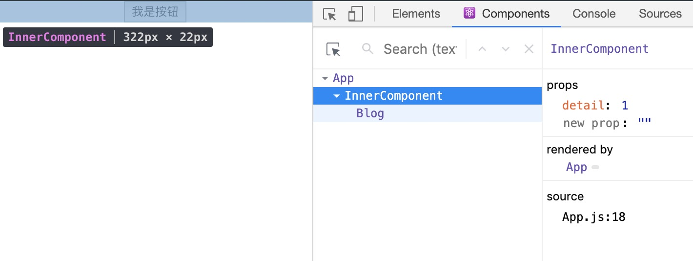

## 初识React你应该知道的一些点

### 前言
你盼时间，我盼望你无`bug`。Hello 大家好，我是霖呆呆！
噗...没啥好说的，忍住，看文章吧[哭笑～]

### 组件

组件允许你将UI拆分为独立可复用的代码片段，每个片段进行独立构思。

> 组件，从概念上类似于 JavaScript 函数。它接受任意的入参（即 “props”），并返回用于描述页面展示内容的 React 元素。

- 函数组件

  ```javascript
  function Welcome (props) {
  	return <h2>Hello, {props.name}</h2>;
  }
  ```

- class组件

  ```javascript
  class Welcome extends React.Component {
  	render () {
  		return <h2>Hello, {this.props.name}</h2>;
  	}
  }
  ```

以上两个组件是等效的。

**注意：** 组件名称必须以大写字母开头。

React 会将以小写字母开头的组件视为原生 DOM 标签。例如，`` 代表 HTML 的 div 标签，而 `` 则代表一个组件，并且需在作用域内使用 `Welcome`。


### State

正确的使用`setState()`：

- 不要直接修改`State`：

   ```javascript
  // 错误
  this.state.msg = 'LinDaiDai'
  
  // 正确
  this.setState({ msg: 'LinDaiDai' })
  ```

- `State`的更新可能是异步的，如果更新的`state`中有依赖到`state`或者`props`则可以用函数：

  ```javascript
  // 错误
  this.setState({
  	counter: this.state.counter + this.props.increment
  });
  
  // 正确
  this.setState((state, props) => ({
  	counter: state.counter + props.increment
  }));
  
  // 使用普通函数也可以
  this.setState(function(state, props) {
    return {
      counter: state.counter + props.increment
    };
  });
  ```

- `State`的更新可能会被合并

  当你调用 `setState()` 的时候，React 会把你提供的对象合并到当前的 state。

  例如，你的 state 包含几个独立的变量：

  ```react
  constructor(props) {
    super(props);
    this.state = {
      posts: [],
      comments: []
    };
  }
  ```

  然后你可以分别调用 `setState()` 来单独地更新它们：

  ```javascript
    componentDidMount() {
      fetchPosts().then(response => {
        this.setState({
          posts: response.posts
        });
      });
  
      fetchComments().then(response => {
        this.setState({
          comments: response.comments
        });
      });
    }
  ```

  这里的合并是浅合并，所以 `this.setState({comments})` 完整保留了 `this.state.posts`， 但是完全替换了 `this.state.comments`。

  https://react.docschina.org/docs/state-and-lifecycle.html#state-updates-are-merged


### 事件

解决事件中`this`绑定的问题，如果不想用`bind`显式绑定的话，可以使用下面两种方式：

- `class fields`语法：

  ```react
  class LoggingButton extends React.Component {
    // 此语法确保 `handleClick` 内的 `this` 已被绑定。
    // 注意: 这是 *实验性* 语法。
    handleClick = () => {
      console.log('this is:', this);
    }
  
    render() {
      return (
        <button onClick={this.handleClick}>
          Click me
        </button>
      );
    }
  }
  ```

- 在回调中使用箭头函数

  ```react
  class LoggingButton extends React.Component {
    handleClick() {
      console.log('this is:', this);
    }
  
    render() {
      // 此语法确保 `handleClick` 内的 `this` 已被绑定。
      return (
        <button onClick={() => this.handleClick()}>
          Click me
        </button>
      );
    }
  }
  ```

  > 此语法问题在于每次渲染 `LoggingButton` 时都会创建不同的回调函数。在大多数情况下，这没什么问题，但如果该回调函数作为 prop 传入子组件时，这些组件可能会进行额外的重新渲染。我们通常建议在构造器中绑定或使用 class fields 语法来避免这类性能问题。


### 组合VS继承

`React`中并没有类似于`Vue`中的`slot`，不过可以靠`prop`来实现：

```javascript
function SplitPane(props) {
  return (
    <div className="SplitPane">
      <div className="SplitPane-left">
        {props.left}
      </div>
      <div className="SplitPane-right">
        {props.right}
      </div>
    </div>
  );
}

function App() {
  return (
    <SplitPane
      left={
        <Contacts />
      }
      right={
        <Chat />
      } />
  );
}
```


### 语法需要注意的点

#### 1. 数字0依旧会被渲染

`false`, `null`, `undefined`是合法的子元素，但它们并不会渲染，因此可以作为判断`JSX`表达式渲染结果：

```jsx
<div>
  {showHeader && <Header />}
  <Content />
</div>
```

但是数字`0`，仍然会被 React 渲染。例如，以下代码并不会像你预期那样工作，因为当 `props.messages` 是空数组时，`0` 仍然会被渲染：

```jsx
<div>
  {props.messages.length &&
    <MessageList messages={props.messages} />
  }
</div>
```

解决方式：确保 `&&` 之前的表达式总是布尔值：

```jsx
<div>
  {props.messages.length > 0 &&
    <MessageList messages={props.messages} />
  }
</div>
```


#### 2. 元素和组件

元素：React 元素是构成 React 应用的基础砖块。元素描述了你在屏幕上想看到的内容。React 元素是不可变对象。例如：

```javascript
const element = <h1>Hello, world</h1>;
```

组件：React 组件是可复用的小的代码片段，它们返回要在页面中渲染的 React 元素。例如：

```javascript
function Welcome(props) {
  return <h1>Hello, {props.name}</h1>;
}
```


### 如何阻止组件不更新

以下生命周期默认是返回`true`，只要将其改为`false`即不更新。

```
shouldComponentUpdate(nextProps, nextState) {
    return false;
  }
```


### 其它API

#### 在组件上能调用的方法

不同于上述生命周期方法（React 主动调用），以下方法是你可以在组件中调用的方法。

只有两个方法：`setState()` 和 `forceUpdate()`。


#### forceUpdate()强制组件重新渲染

默认情况下，当组件的 state 或 props 发生变化时，组件将重新渲染。如果 `render()` 方法依赖于其他数据，则可以调用 `forceUpdate()` 强制让组件重新渲染。

调用 `forceUpdate()` 将致使组件调用 `render()` 方法，此操作会跳过该组件的 `shouldComponentUpdate()`。

但其子组件会触发正常的生命周期方法，包括 `shouldComponentUpdate()` 方法。如果标记发生变化，React 仍将只更新 DOM。

注意⚠️：

通常你应该避免使用 `forceUpdate()`，尽量在 `render()` 中使用 `this.props` 和 `this.state`。


### Class属性

#### defaultProps

`defaultProps` 可以为 Class 组件添加默认 props。这一般用于 props 未赋值，但又不能为 null 的情况:

```javascript
class CustomButton extends React.Component {
  // ...
}

CustomButton.defaultProps = {
  color: 'blue'
};
```

上述`CustomButton`被调用时如果没有提供`props.color`，则默认为`blue`。

此时如果传递了`null`的话，则就会是`null`：

```javascript
render() {
  return <CustomButton color={null} /> ; // props.color 将保持是 null
}
```


#### displayName

`displayName` 字符串多用于调试消息。通常，你不需要设置它，因为它可以根据函数组件或 class 组件的名称推断出来。

**用处**：

调试时需要显示不同的名称或创建高阶组件。`displayName`可以方便我们在使用`Chrome`浏览器插件的情况下通过审查元素看到具体是哪个组件。

例如你要审查的这个元素是一个`HOC`产物，如下一个简单的案例🌰：

*LoginHOC.tsx*:

```jsx
import React, { Component } from 'react';

export default function LoginHoc (WrappedComponent) {
  class InnerComponent extends Component {
    render () {
      return (
        <WrappedComponent {...this.props}></WrappedComponent>
      )
    }
  }
  return InnerComponent;
}
```

*Blog.tsx*:

```jsx
import React, { Component } from 'react';
import LoginHOC from './LoginHOC';

class Blog extends Component {
  render () {
    return (
      <div className='blog'>
        <button>我是按钮</button>
      </div>
    )
  }
}

export default LoginHOC(Blog);
```

在`App.js`中引用：

```javascript
import Blog from './components/HOC-example/Blog';

function App () {
  return (
    <div className='App'>
      <Blog detail={1}></Blog>
    </div>
  )
}
export default App;
```

这时候使用`Chrome`插件[React Developer Tools](https://github.com/facebook/react-devtools)调试时，会发现页面中的元素为这样：



此时如果你给`HOC`设置了`displayName`的话：

```diff
import React, { Component } from 'react';

export default function LoginHoc (WrappedComponent) {
  class InnerComponent extends Component {
    render () {
      return (
        <WrappedComponent {...this.props}></WrappedComponent>
      )
    }
  }
+ InnerComponent.displayName = `LoginHoc(${getDisplayName(WrappedComponent)})`;
  return InnerComponent;
}
+ function getDisplayName (WrappedComponent) {
+  return WrappedComponent.displayName || WrappedComponent.name || 'Component'
+}
```

效果如下：


能更加清楚的让我们看到包装显示名称。


### ReactDOM

`react-dom` 的 package 提供了可在应用顶层使用的 DOM（DOM-specific）方法，如果有需要，你可以把这些方法用于 React 模型以外的地方。不过一般情况下，大部分组件都不需要使用这个模块。

- `render`:
  - `React.render(element, container[, callback])`
  - 在提供的 `container` 里渲染一个 React 元素，并返回对该组件的[引用](https://react.docschina.org/docs/more-about-refs.html)（或者针对[无状态组件](https://react.docschina.org/docs/components-and-props.html#function-and-class-components)返回 `null`）。
- `hydrate`:
  - `ReactDOM.hydrate(element, container[, callback])`
  - 与 [`render()`](https://react.docschina.org/docs/react-dom.html#render) 相同，但它用于在 [`ReactDOMServer`](https://react.docschina.org/docs/react-dom-server.html) 渲染的容器中对 HTML 的内容进行 hydrate 操作。
- `unmountComponentAtNode()`
  - `ReactDOM.unmountComponentAtNode(container)`
  - 从 DOM 中卸载组件，会将其事件处理器（event handlers）和 state 一并清除。
- `findDOMNode()`
  - `ReactDOM.findDOMNode(component)`
  - `findDOMNode` 是一个访问底层 DOM 节点的应急方案，在大多数情况下，不推荐使用该方法，因为它会破坏组件的抽象结构。[严格模式下该方法已弃用。](https://react.docschina.org/docs/strict-mode.html#warning-about-deprecated-finddomnode-usage)
  - **大多数情况下，你可以绑定一个 ref 到 DOM 节点上，可以完全避免使用 findDOMNode。**
  - `findDOMNode` 不能用于函数组件。
- `createPortal()`
  - `ReactDOM.createPortal(child, container)`
  - 创建 portal。[Portal](https://react.docschina.org/docs/portals.html) 将提供一种将子节点渲染到 DOM 节点中的方式，该节点存在于 DOM 组件的层次结构之外。


### DOM相关

#### className

`className` 属性用于指定 CSS 的 class，此特性适用于所有常规 DOM 节点和 SVG 元素，如 ``，`` 及其它标签。

如果你在 React 中使用 Web Components（这是一种不常见的使用方式），请使用 class 属性代替。


#### dangerouslySetInnerHTML

`dangerouslySetInnerHTML` 是 React 为浏览器 DOM 提供 `innerHTML` 的替换方案。通常来讲，使用代码直接设置 HTML 存在风险，因为很容易无意中使用户暴露于[跨站脚本（XSS）](https://en.wikipedia.org/wiki/Cross-site_scripting)的攻击。

使用：

设置一个带有属性名为`key`的对象：

```js
function createMarkup() {
  return {__html: 'First &middot; Second'};
}

function MyComponent() {
  return <div dangerouslySetInnerHTML={createMarkup()} />;
}
  
// 使用
<MyComponent></MyComponent>
```

最终会被渲染为：

```
First · Second
```


#### style

`style`属性接收的是一个对象，这点和`DOM`中`style`的`JavaScript`属性一样，同时会更高效的，且能预防跨站脚本（XSS）的安全漏洞。例如：

```jsx
const divStyle = {
  color: 'blue',
  backgroundImage: 'url(' + imgUrl + ')',
};

function HelloWorldComponent() {
  return <div style={divStyle}>Hello World!</div>;
}
```

需要注意的点：

- 样式不会自动补齐前缀。如需支持旧版浏览器，需要手动补充对应的样式属性：

  ```jsx
  const divStyle = {
    WebkitTransition: 'all', // note the capital 'W' here
    msTransition: 'all' // 'ms' is the only lowercase vendor prefix
  };
  ```

  浏览器引擎前缀都应以大写字母开头，[除了 `ms`](https://www.andismith.com/blog/2012/02/modernizr-prefixed/)。因此，`WebkitTransition` 首字母为 ”W”。

- React 会自动添加 ”px” 后缀到内联样式为数字的属性后。如需使用 ”px” 以外的单位，请将此值设为数字与所需单位组成的字符串。例如：

  ```jsx
  // Result style: '10px'
  <div style={{ height: 10 }}>
    Hello World!
  </div>
  
  // Result style: '10%'
  <div style={{ height: '10%' }}>
    Hello World!
  </div>
  ```


### 合成事件

我们知道在普通的`DOM`元素中有一个`event`对象来获取事件对象。

而在`React`中，获取到的这个事件对象被称为合成事件`SyntheticEvent`。

它是浏览器的原生事件的跨浏览器包装器。除兼容所有浏览器外，它还拥有和浏览器原生事件相同的接口，包括 `stopPropagation()` 和 `preventDefault()`。

每个 `SyntheticEvent` 对象都包含以下属性：

```typescript
boolean bubbles
boolean cancelable
DOMEventTarget currentTarget
boolean defaultPrevented
number eventPhase
boolean isTrusted
DOMEvent nativeEvent
void preventDefault()
boolean isDefaultPrevented()
void stopPropagation()
boolean isPropagationStopped()
void persist()
DOMEventTarget target
number timeStamp
string type
```


#### 事件池

如上所述，`SyntheticEvent`是一个合成事件，如果我们在事件的回调函数中直接打印它出来，获取到的属性值全都是`null`或者`undefined`。

例如这段代码：

```jsx
import React, { Component } from 'react';

export default class SyntheticEvent extends Component {
  clickBtn (event) {
    console.log(event); // nullified object
    console.log(event.type); // "click"
  }
  render () {
    return (
      <>
        <button onClick={this.clickBtn.bind(this)}>
          点击我
        </button>
      </>
    )
  }
}
```

`event`拿到的对象：

```javascript
{
 detail: null,
 type: null,
 nativeEvent: null,
 isTrusted: null,
 ...
}
```

所以有了官网的这句话：

`SyntheticEvent` 是合并而来。这意味着 `SyntheticEvent` 对象可能会被重用，而且在事件回调函数被调用后，所有的属性都会无效。出于性能考虑，你不能通过异步访问事件。

再如下：

```jsx
function clickBtn(event) {
  console.log(event); // => nullified object.
  console.log(event.type); // => "click"
  const eventType = event.type; // => "click"

  setTimeout(function() {
    console.log(event.type); // => null
    console.log(eventType); // => "click"
  }, 0);

  // 不起作用，this.state.clickEvent 的值将会只包含 null
  this.setState({clickEvent: event});

  // 你仍然可以导出事件属性
  this.setState({eventType: event.type});
}
```


如果你想异步访问事件属性，你需在事件上调用 `event.persist()`，此方法会从池中移除合成事件，允许用户代码保留对事件的引用。

```javascript
clickBtn (event) {
  event.persist()
  console.log(event);
  console.log(event.type);
}
```

现在的`event`：

```javascript
{
 detail: 1,
 type: 'click',
 nativeEvent: {...},
 isTrusted: true,
 ...
}
```


#### 处理捕获阶段的点击事件

处理捕获阶段的点击事件请使用 `onClickCapture`，而不是 `onClick`。


