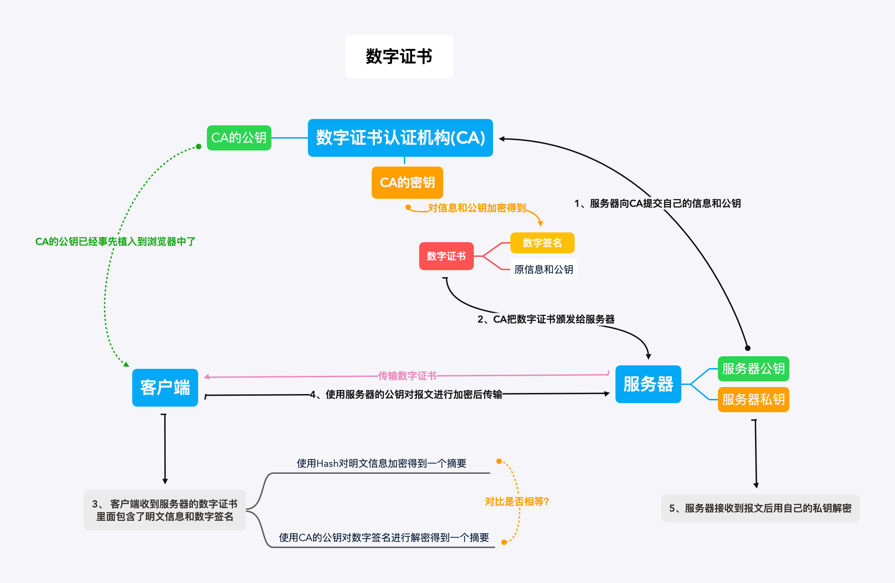

# HTTPS

### 1. 请你概述一下HTTPS的工作流程

（简单的叙述，如果面试官要听具体的过程可以看第8题）

难度：🌟🌟🌟

HTTPS主要是采用对称密钥加密和非对称密钥加密组合而成的混合加密机制进行传输。

也就是发送密文的一方用"对方的公钥"进行加密处理"对称的密钥"，然后对方在收到之后使用自己的私钥进行解密得到"对称的密钥"，这在确保双发交换的密钥是安全的前提下使用对称密钥方式进行通信。

这个过程简单来说就是：

1. 客户端首先向服务端发送一个HTTPS请求
2. 服务端会把事先配置好的公钥证书随着其它的信息返回给客户端
3. 客户端在收到服务端发来的证书之后进行验证，验证的过程参考数字证书验证，会得到服务端的信息以及它的公钥
4. 验证成功之后生成一个叫做 client_params 的参数发送给服务器；同时自己会用伪随机函数生成一个 secret，这个secret就是它们后续进行通信的对称密钥。
5. 服务器在收到刚刚的 client_params之后，也会根据伪随机函数生成一个secret。这时候双方都有了相同的对称密钥。
6. 后面的传输都会用这个 secret 进行对称密钥加解密传输

### 2. 刚刚你提到的对称密钥加密和非对称密钥加密它们有什么区别吗？

难度：🌟🌟

对称密钥加密是最简单的一种加密方式，它的加解密用的都是相同的密钥，这样带来的好处就是加解密效率很快，但是并不安全，如果有人拿到了这把密钥那谁都可以进行解密了。

而非对称密钥会有两把密钥，一把是私钥，只有自己才有；一把是公钥，可以发布给任何人。并且加密的内容只有相匹配的密钥才能解。这样带来的一个好处就是能保证传输的内容是安全的，因为例如如果是公钥加密的数据，就算是第三方截取了这个数据但是没有对应的私钥也破解不了。不过它也有缺点，一是公钥因为是公开的，谁都可以过去，如果内容是通过私钥加密的话，那拥有对应公钥的黑客就可以用这个公钥来进行解密得到里面的信息；二来公钥里并没有包含服务器的信息，也就是并不能确保服务器身份的合法性；并且非对称加密的时候要消耗一定的时间，减低了数据的传输效率。

### 3. 那混合加密机制的好处是什么呢？

难度：🌟🌟

刚刚已经说到了对称密钥加密和非对称密钥加密都有它们各种的优缺点，而混合加密机制就是将两者结合利用它们各自的优点来进行加密传输。

比如既然对称密钥的优点是加解密效率快，那么在客户端与服务端确定了连接之后就可以用它来进行加密传输。不过前提是得解决双方都能安全的拿到这把对称密钥。这时候就可以里用非对称密钥加密来传输这把对称密钥，因为我们知道非对称密钥加密的优点就是能保证传输的内容是安全的。

所以它的好处是即保证了对称密钥能在双方之间安全的传输，又能使用对称加密方式进行通信，这比单纯的使用非对称加密通信快了很多。以此来解决了HTTP中内容可能被窃听的问题。

### 4. 那混合加密的缺点呢？

难度：🌟🌟

混合加密主要是为了解决HTTP中内容可能被窃听的问题。但是它并不能保证数据的完整性，也就是说在传输的时候数据是有可能被第三方篡改的，比如完全替换掉，所以说它并不能校验数据的完整性。如果需要做到这一点就需要使用到数字签名。

### 5. 数字签名？它是什么？

（数字签名的概念以及验证流程）

难度：🌟🌟🌟

数字签名的产生主要就是为了解决HTTP中内容可能被篡改的问题，即校验数据的完整性。它能确定消息是发送方发送过来的，因为这里会有一个验证数字签名的过程，别人是假冒不了发送方的签名的。

数字签名它是什么呢？它的产生过程其实就是两步，第一步将原文用Hash函数生成一个叫消息摘要的东西，第二步就是用发送方的私钥对这个消息摘要进行进行加密。这个产生的东西就叫做数字签名，它一般会与原文一起发送给接收者。

而验证它的过程其实也并不复杂。

- 首先发送方会将原文与数字签名(也就是加密后的摘要)一起发送给接收方
- 接收方会接收到这两样东西，即原文和数字签名
- 接收方用Hash函数处理原文会得到一份消息摘要
- 同时用发送方的公钥解密数字签名也会得到一份消息摘要
- 只要比较这两份消息摘要是否相等就可以验证出数据有没有被篡改了

当然这里关键的一步就是要保证发送方传递过来的公钥是可信赖的，这时候就得用到数字证书了。

### 6. 既然提到了数字证书那你就说说它吧

（数字证书的概念以及颁发流程）

难度：🌟🌟🌟

数字证书也叫公钥证书，或者简称证书。它主要是为了解决通信方身份遭伪装的问题，也就是验证通信方的身份。

因为我们知道在HTTPS中虽然有了混合加密机制保证数据不被监听，有了数字签名校验数据的完整性，但是数字签名校验的前提是能拿到发送方的公钥，并且保证这个公钥是可信赖的，所以就需要数字证书。

它简单来说其实是由一些权威的数字认证机构颁发给服务器的一个文件。数字认证机构简称CA，它是客户端和服务端都信任的第三方机构，我知道比较有名的一个就是威瑞信(VeriSign)。至于颁发证书的流程，主要是为：

- 服务器的运营人员会向认证机构提交自己的公钥、组织信息、个人信息等并申请认证
- 而认证机构在拿到这些信息后会通过线上、线下各种途径验证申请者提交信息的真实性
- 在确认其真实性后，认证机构给这些信息(申请者的公钥，组织信息，个人信息以及认证机构自己的信息等)，我们简称为明文信息，进行数字签名，过程也就是签名提到的数字签名的步骤：1.通过Hash函数处理明文信息生成一个信息摘要；2.再用认证机构自己的私钥对信息摘要进行加密处理。通过这两个步骤生成的文件就叫数字签名。
- 之后会将明文信息和数字签名组合而成的证书颁发给申请者，也就是服务器。

我画了证书的颁发流程：

（如果上面的图片加载不出来，可以看这里：https://hexo-blog-1256114407.cos.ap-shenzhen-fsi.myqcloud.com/%E6%95%B0%E5%AD%97%E8%AF%81%E4%B9%A6.png）

### 7.为什么说数字证书就能对通信方的身份进行验证呢？

（数字证书使得浏览器能验证服务器，还有它的验证过程）

难度：🌟🌟🌟

那是因为在客户端第一次给服务端发送HTTPS请求的时候，服务端会将它自己的证书随着其它的信息(例如server_random、 server_params、需要使用的加密套件等东西)一起返给客户端。

客户端在收到之后首先会验证这个证书，只有验证通过之后才会有后续操作。而验证的过程其实也就是数字签名的验证过程(题5)：

- 前面说过了，证书其实是由明文信息(申请者的公钥，组织信息，个人信息以及认证机构自己的信息等)和这个明文信息的数字签名组成的。(对应着题5也就是原文和数字签名)
- 客户端会用Hash函数处理明文信息生成一个信息摘要
- 然后再用内置在浏览器上的**CA的公钥**来解密证书里的数字签名，得到一个信息摘要。因为我们知道证书实际是由CA颁发给服务器的，并且里面的数字签名也是用的CA的私钥加密的，所以只有CA的公钥才能解。
- 最后再将两个信息摘要进行对比，若是一样则能保证通信方的身份是正确的。

其实验证证书的过程不仅仅是数字签名的验证，客户端还会验证证书相关的域名信息，有效时间，是不是在CRL吊销列表里，以及它的上一级是否有效等等。

（一般答到这里就可以了，如果面试官继续问你上一级是否有效这样验证，你就回答：这是一个递归的过程，直到验证到根证书也就是操作系统内置的Root证书或者浏览器内置的Root证书为止）

就像前面说的，只有能用**CA的公钥**解密的数字签名并且通过了认证的证书才是有效的，因为证书是CA颁布的。这也就保证了客户端收到的服务器发来的公钥是真实可用的(因为公钥在证书的明文信息里)。

（想想其实很好理解，因为浏览器它自己没有辨别证书是否合法的能力，它就把这事交给CA去做，CA是信任的过的机构，它只要把自己的公钥内嵌到浏览器里，浏览器再用这个CA公钥来解证书里的签名就可以了。而证书的签名也是经过CA的私钥加密生成的，只有CA的公钥能解，但它的公钥又不是随便人能拿到的，只有各大浏览器厂商才有，所以这就是数字证书的验证过程）

### 8. 请详细的说一下HTTPS它的加密传输过程，涉及到哪些算法呢？

（前面的第1题只是概述，若是面试官叫你详细的说一下，涉及到具体算法的时候可以答这里）

难度：🌟🌟🌟🌟

在HTTPS加密传输中，实际上涉及到 SSL/TLS 协议，这里是有一个TSL握手的过程。对于传统的TLS握手也就是RSA握手我就不描述了，主要是说一下现在主流的TLS1.2版本的握手，也就是ECDHE握手。

它的过程大致来说是这样的：

1. 客户端在第一次发送HTTPS请求的时候，会把 client_random、TSL版本号、加密套件列表发送给服务器

2. 服务器在接收到之后确认TSL的版本号，同时发送 server_random、server_params、需要使用的加密套件、以及自己的证书给客户端

3. 客户端在收到这些信息之后，首先是会对服务器的证书进行验证(也就是题目7)，若是验证成功则会传递一个 client_params 给服务器

4. 与此同时客户端会通过**ECDHE算法**计算出一个pre_random，其中是传入了两个参数，一个是 client_params，还一个是 server_params。(也就是说：ECDHE(client_params, server_params) = per_random)

5. 这时候客户端就同时拥有了 client_random、server_random、pre_random，它会将这三个参数通过一个**伪随机函数**计算得出最终的secret，这个secret就是它们后续通信所要用的对称密钥。

6. 而在客户端生成完secret之后，会给服务器发送一个收尾消息，告诉服务器之后都要用对称加密，且对称加密的算法是用第一次约定好的。

7. 服务器它在接收到刚刚传递过来的client_params之后，也会使用和客户端一样的方式生成secret，并且也会发送一个收尾消息给客户端。

8. 当双方都收到收尾消息并验证成功之后，握手就结束了。后面开始用这个secret对称密钥加密报文进行传输。

（ECDHE基于**椭圆曲线离散对数**，传入的两个参数也被叫做**椭圆曲线的公钥**）

（此时面试官如果要问你RSA握手的细节就看题目9,10。如果不的话可能会问你RSA握手和ECDHE握手的区别，就看题目11）

### 9. 可我就是想你描述一下RSA握手

（这道题主要是怕面试官还想你再描述一下RSA握手，当然你也可以先用这个简单的版本说给他听，详细描述看题10）

难度：🌟🌟🌟

1. 客户端首先向服务端发送一个HTTPS请求
2. 服务端会把事先配置好的公钥证书随着其它的信息返回给客户端
3. 客户端在收到服务端发来的证书之后进行验证，验证的过程参考数字证书验证，会得到服务端的信息以及它的公钥
4. 验证成功之后会用**伪随机函数**计算出一个加密所需要的对称密钥(secret)，并且用服务端的公钥加密这个对称密钥发送给服务端
5. 服务端再用自己的私钥解密刚刚的消息，得到里面的对称密钥。此时服务端和客户端都有了对称密钥。
6. 后面的传输都会用这个 secret 进行对称密钥加解密传输

### 10. 能否详细描述一下RSA握手呢？

（还问你细节的话...就用这套）

难度：🌟🌟🌟🌟

1. 客户端首先发送 client_random、TSL版本号、加密套件列表给服务器
2. 服务器在接收到之后确认TSL版本号，同时发送server_random、需要使用的加密套件、自己的证书给客户端
3. 客户端在收到这些信息之后，首先是会对服务器的证书进行验证(也就是题目7)，若是验证成功则会用RSA算法生成一个pre_random，且用服务器的公钥(在证书中)加密pre_random发送给服务器。
4. 此时，客户端有了 client_random、server_random、pre_random，它会将这三个参数通过一个**伪随机函数**计算得出最终的secret，这个secret就是它们后续通信所要用的对称密钥。
5. 服务器接收到了刚刚用自己公钥加密的pre_random之后，用自己的私钥进行解密，得到里面的  pre_random，用和客户端一样的方式生成secret。
6. 之后就用这个 secret对称密钥加密报文传输。

（可以和题目8做一个对比，你很容易就可以看出，只是 step3 ，4，5不同而已）

### 11. 那么ECDHE握手和RSA握手又有什么区别呢？

难度：🌟🌟🌟

它们的区别主要是：

1. 生成secret(对称密钥)的过程不同。RSA中是使用RSA算法生成一个pre_random并用服务器的公钥加pre_random发送给服务器，然后各自用伪随机函数生成相同的secret对称密钥；而在ECDHE握手中，它没有用到RSA算法，而是用ECDHE算法生成的pre_random，且这个过程中比RSA多了client_params和server_params两个参数。
2. 在生成完secret之后，ECDHE握手在客户端发送完收尾消息后可以提前`抢跑`，直接发送 HTTP 报文，节省了一个 RTT，不必等到收尾消息到达服务器，然后等服务器返回收尾消息给自己，直接开始发请求。这也叫`TLS False Start`。
3. 最主要的：RSA不具备向前安全性，ECDHE有

（向前安全性：一次破解并不影响历史信息的性质就是向前安全性）

### 12. 向前安全性？

难度：🌟🌟

一句话概括：一次破解并不影响历史信息的性质就是向前安全性。

比如在RSA握手的过程中，客户端拿到了服务端的公钥，然后用此公钥加密pre_random给服务端。如果此时有第三方有服务端的私钥，并且截获了之前所有报文的时候，那么它就可以破解这段密文并拿到pre_random、client_random、server_random并根据对应的伪随机函数生成secret，即拿到了最终通信的对称密钥，每一个历史报文都能通过这样的方式进行破解。它就不具有向前安全性。

但是ECDHE在每次握手的时候都会产生一个零时的密钥对(也就是client_params、server_params)，即使第三方有了私钥能破解，但是对之前的历史报文并没有影响。它就具有向前安全性。

### 13. 那你知道TSL1.3版本吗？它较TSL1.2做了哪些改进呢？

TSL1.3版本是2018年推出的。它较TSL1.2主要是做了以下改进：

1. 强化安全

废除了很多的加密算法，只保留了5个加密套件。其中最主要的是废弃了RSA，因为在2015年发现了PRAEK攻击，即已经有人发现了RSA的漏洞能进行破解；而且RSA不具备向前安全性。

2. 提高性能

同时利用会话复用节省了重新生成密钥的时间，利用 PSK 做到了0-RTT连接。

