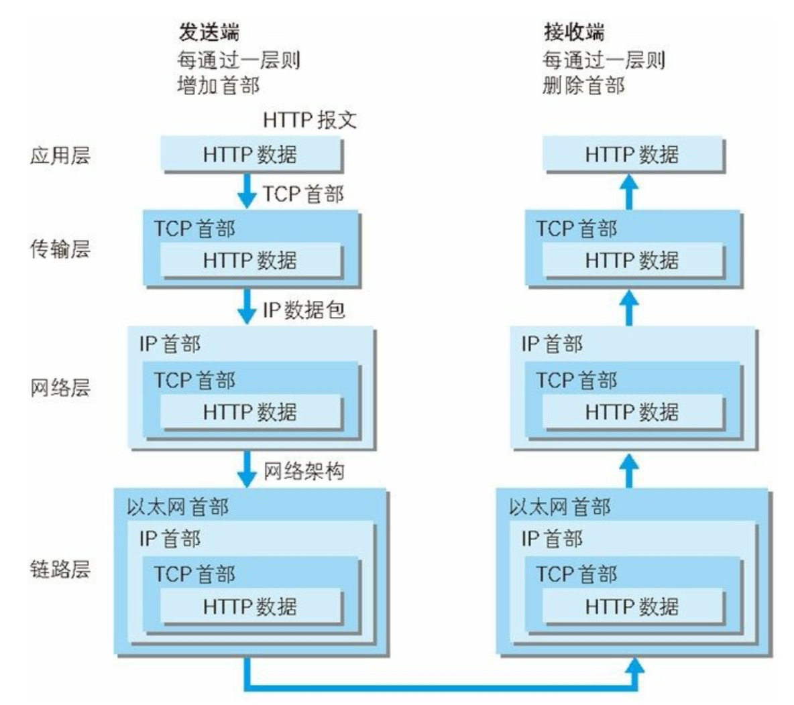

# HTTP图解笔记

## TCP/IP协议

### 什么是TCP/IP协议？

 把与互联网相关联的协议集合起来总称为`TCP/IP`。

### TCP/IP协议族层次分为几层？为什么要分层？

分为以下四层：应用层、传输层、网络层、数据链路层(其实也就是我们经常看到的五层模型的前四层)

层次化的好处：设计相对简单了，每层各施其职，只需要管好自己的任务。并且如果某个地方的设计需要改动也不需要替换整体，只需要把变动的层替换掉就行了。

### 大致说一下这四层的作用

1. 应用层：

作用：向用户提供应用服务时通信的活动

在应用层中会有很多协议，例如：

- `HTTP`协议
- `FTP`文件传输协议(`File Transfer Protocol`)
- `DNS`域名系统解析协议(`Domain Name System`)

2. 传输层：

作用：提供处于网络连接中的两台计算机之间的数据传输

传输层中的协议(两个性质不同)：

- `UDP`用户数据报协议(`User Datagram Protocol`)：提供无连接的，尽最大努力的数据传输服务（不保证数据传输的可靠性）。
- `TCP`传输协议(`Transimission Control Protocol`)：面向连接的，数据传输单位是报文段，能提供可靠的交付。

3. 网络层

作用：处理网络上流动的数据包，规定了双方之间进行数据传输时的路线

在网络层中的协议：

- `IP`协议：在网络中通常使用IP地址+端口号来定位一个程序在计算机中的位置，这种方式就是一种IP协议。

4. 数据链路层

作用：用来处理连接网络的硬件部分，例如控制操作系统、硬件的设备驱动、网卡、光纤等。

### TCP/IP通信传输流

通过分层顺序与对方通信，发送端从应用层往下走，接收端往应用层往上走。

发送端经过每一层时都会打上该层所属的头部信息；接收端则相反，经过每一层把对应的首部消去。

经过各个层时做的事：

- 应用层：生成针对目标Web服务器的HTTP请求报文
- 传输层：将接收到的数据(HTTP请求报文)进行分割，并在每个报文上打上标记序号以及端口号
- 网络层：增加通信目的地的MAC地址

### URI和URL的区别

- URI用字符串表示网络中的某个资源
- URL表示资源的具体地址

### 你所知道的服务器地址名类型有哪些？

- 我们常用的能够被DNS所解析的域名地址：`www.example.com`
- IPv4地址：192.168.1.2
- IPv6地址：[0:0:0:0:0:0:0:0:1] 用方括号括起来

## HTTPS

### 什么是HTTPS?

并非是一种新的协议，只是通信接口部分用SSL或者TLS协议替代(在HTTP和TCP之间建立中间层)。换句话说HTTPS其实就是身披SSL协议这层外壳的HTTP。
HTTPS = HTTP + SSL/TLS

采用SSL后HTTP就有了HTTPS的加密、证书和完整性保护这些功能。

### 什么是第三方认证？

产生原因：保证客户端拿到的公钥是真实有效的

### 对称密钥加密

对称密钥加密(共享密钥加密)
Common key crypto system

是最简单的加密方式
指加密解密用的都是相同的密钥

