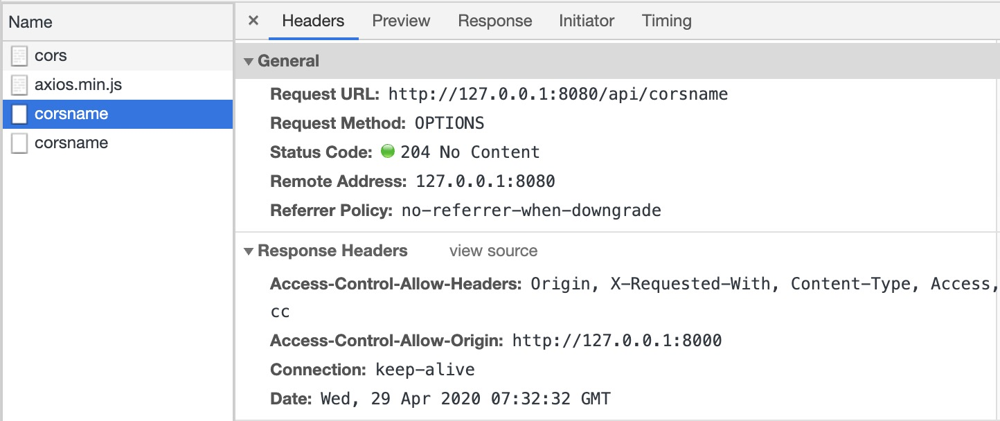
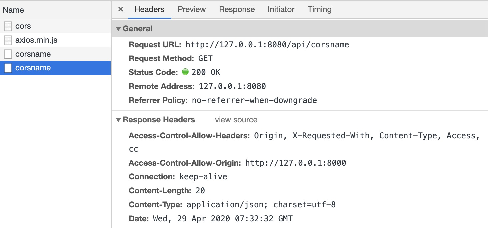

## CORS原理及实现

### CORS跨域的原理

跨域资源共享(`CORS`)是一种机制，是W3C标准。它允许浏览器向跨源服务器，发出`XMLHttpRequest`或`Fetch`请求。并且整个`CORS`通信过程都是浏览器自动完成的，不需要用户参与。

而使用这种`跨域资源共享`的前提是，浏览器必须支持这个功能，并且服务器端也必须同意这种`"跨域"`请求。因此实现`CORS`的关键是服务器需要服务器。通常是有以下几个配置：

- **Access-Control-Allow-Origin**
- **Access-Control-Allow-Methods**
- **Access-Control-Allow-Headers**
- **Access-Control-Allow-Credentials**
- **Access-Control-Max-Age**

具体可看：https://developer.mozilla.org/zh-CN/docs/Web/HTTP/Access_control_CORS#Preflighted_requests

过程分析：

- 浏览器先根据同源策略对前端页面和后台交互地址做匹配，若同源，则直接发送数据请求；若不同源，则发送跨域请求。

- 服务器收到浏览器跨域请求后，根据自身配置返回对应文件头。若未配置过任何允许跨域，则文件头里不包含 `Access-Control-Allow-origin` 字段，若配置过域名，则返回 `Access-Control-Allow-origin + 对应配置规则里的域名的方式`。

- 浏览器根据接受到的 响应头里的 `Access-Control-Allow-origin` 字段做匹配，若无该字段，说明不允许跨域，从而抛出一个错误；若有该字段，则对字段内容和当前域名做比对，如果同源，则说明可以跨域，浏览器接受该响应；若不同源，则说明该域名不可跨域，浏览器不接受该响应，并抛出一个错误。

另外在`CORS`中有`简单请求`和`非简单请求`，简单请求是不会触发`CORS`的预检请求的，而非简单请求会。

`“需预检的请求”`要求必须首先使用 [`OPTIONS`](https://developer.mozilla.org/zh-CN/docs/Web/HTTP/Methods/OPTIONS)  方法发起一个预检请求到服务器，以获知服务器是否允许该实际请求。"预检请求“的使用，可以避免跨域请求对服务器的用户数据产生未预期的影响。


### CORS的哪些是简单请求？

简单请求不会触发`CORS`的预检请求，若请求满足所有下述条件，则该请求可视为“简单请求”：

**简单回答**：

- 只能使用`GET`、`HEAD`、`POST`方法。使用`POST`方法向服务器发送数据时，`Content-Type`只能使用`application/x-www-form-urlencoded`、`multipart/form-data`或`text/plain`编码格式。
- 请求时不能使用自定义的`HTTP Headers`

**详细回答**：

- (一) 使用下列方法之一
  - `GET`
  - `HEAD`
  - `POST`
- (二) 人为设置以下集合外的请求头
  - `Accept`
  - `Accept-Language`
  - `Content-Language`
  - `Content-Type`(但是有限制)
  - `DPR`
  - `Downlink`
  - `Save-Data`
  - `Viewport-Width`
  - `Width`
- (三) `Content-Type`的值仅限于下面的三者之一
  - `text/plain`
  - `multipart/form-data`
  - `application/x-www-form-urlencoded`

- 请求中的任意[`XMLHttpRequestUpload`](https://developer.mozilla.org/zh-CN/docs/Web/API/XMLHttpRequestUpload) 对象均没有注册任何事件监听器；[`XMLHttpRequestUpload`](https://developer.mozilla.org/zh-CN/docs/Web/API/XMLHttpRequestUpload) 对象可以使用 [`XMLHttpRequest.upload`](https://developer.mozilla.org/zh-CN/docs/Web/API/XMLHttpRequest/upload) 属性访问。
- 请求中没有使用 [`ReadableStream`](https://developer.mozilla.org/zh-CN/docs/Web/API/ReadableStream) 对象。

除了上面这些请求外，都是非简单请求。


### CORS的预检请求具体是怎样的？

若是跨域的非简单请求的话，浏览器会首先向服务器发送一个预检请求，以获知服务器是否允许该实际请求。

整个过程大概是：

- 浏览器给服务器发送一个`OPTIONS`方法的请求，该请求会携带下面两个首部字段：
  - `Access-Control-Request-Method`: 实际请求要用到的方法
  - `Access-Control-Request-Headers`: 实际请求会携带哪些首部字段
- 若是服务器接受后续请求，则这次预请求的响应体中会携带下面的一些字段：
  - `Access-Control-Allow-Methods	`: 服务器允许使用的方法
  - `Access-Control-Allow-Origin`: 服务器允许访问的域名
  - `Access-Control-Allow-Headers`: 服务器允许的首部字段
  - `Access-Control-Max-Age`: 该响应的有效时间(s),在有效时间内浏览器无需再为同一个请求发送预检请求
- 预检请求完毕之后，再发送实际请求

这里有两点要注意：

一：

`Access-Control-Request-Method`没有`s`

`Access-Control-Allow-Methods`有`s`

二：

关于`Access-Control-Max-Age`，浏览器自身也有维护一个最大有效时间，如果该首部字段的值超过了最大有效时间，将不会生效，而是以最大有效时间为主。


### CORS简单请求的案例

还是在原本`JSONP`的那个案例上。

我在根目录下新建了一个文件夹`cors`，并往里面添加了一个`index.html`文件：

**/cors/index.html**

```html
<!DOCTYPE html>
<html lang="en">
<head>
  <meta charset="UTF-8">
  <meta name="viewport" content="width=device-width, initial-scale=1.0">
  <title>CORS</title>
</head>
<body>
  <button id="getName">获取name</button>
  <script src="https://cdn.bootcss.com/axios/0.19.2/axios.min.js"></script>
  <script>
    getName.onclick = () => {
      // 简单请求
      axios.get("http://127.0.0.1:8080/api/corsname");
    }
  </script>
</body>
</html>
```

为了后面也方便调试，用`node`简单写了一个前端的本地服务和后端的本地服务。

在根目录下新建`client.js`文件，并写入：

**./client.js**:

```javascript
const Koa = require('koa');
const fs = require('fs');
const app = new Koa();

app.use(async (ctx) => {
  if (ctx.method === 'GET' && ctx.path === '/') {
    ctx.body = fs.readFileSync('./index.html').toString();
  }
  if (ctx.method === 'GET' && ctx.path === '/cors') {
    ctx.body = fs.readFileSync('./cors/index.html').toString();
  }
})
console.log('client 8000...')
app.listen(8000);
```

在根目录下新建`index.html`文件，并写入：

**./index.html**:

```html
<!DOCTYPE html>
<html lang="en">
<head>
  <meta charset="UTF-8">
  <meta name="viewport" content="width=device-width, initial-scale=1.0">
  <title>Client</title>
</head>
<body>
  <ul>
    <li>
      <a href="/cors">CORS跨域</a>
    </li>
  </ul>
</body>
</html>
```

(以上：实现了一个简单的前端路由效果)

在根目录下新建`server.js`文件，并写入：

**./server.js**:

```javascript
const Koa = require('koa');
const app = new Koa();

app.use(async (ctx, next) => {
  ctx.set("Access-Control-Allow-Origin", ctx.header.origin);
  // ctx.set("Access-Control-Allow-Methods", "PUT,POST,GET,DELETE,OPTIONS");
  // ctx.set("Access-Control-Request-Method", "PUT,POST,GET,DELETE,OPTIONS");
  ctx.set(
    "Access-Control-Allow-Headers", 
    "Origin, X-Requested-With, Content-Type, Access, cc"
  )
  if (ctx.method === 'OPTIONS') {
    ctx.status = 204;
    return;
  }
  await next();
  if (ctx.path === '/api/corsname') {
    ctx.body = {
      data: 'LinDaiDai'
    }
    return;
  }
})
console.log('server 8080...')
app.listen(8080);
```


并给`package.json`中配置两个启动指令：

**package.json**:

```json
{
  "scripts": {
  	"client": "node ./client.js",
  	"server": "node ./server.js"
	}
}
```

OK👌，来分别启动一下`npm run client`和`npm run server`

并打开页面的`127.0.0.1:8000/cors`（或者打开`127.0.0.1:8000`然后点击`CORS`这个`a`标签）

点击`获取name`按钮，可以看到能够正常获取到本地服务器的数据了。


### CORS非简单请求的案例

接着让我们来改造一下`./cors/index.html`中的按钮点击请求，让它变成一个非简单请求：

**./cors/index.html**:

```javascript
getName.onclick = () => {
  // 简单请求
  // axios.get("http://127.0.0.1:8080/api/corsname");

  // 非简单请求
  axios.get('http://127.0.0.1:8080/api/corsname', {
    headers: {
      cc: 'lindaidai'
    }
  })
}
```

此时，打开页面点击按钮会发现发送了两次`corsname`的请求：

（一）预检请求：



（二）实际请求：




### CORS附带身份凭证的案例

对于跨域 [`XMLHttpRequest`](https://developer.mozilla.org/zh-CN/docs/Web/API/XMLHttpRequest) 或 [Fetch](https://developer.mozilla.org/en-US/docs/Web/API/Fetch_API) 请求，浏览器**不会**发送身份凭证信息。如果要发送凭证信息，需要设置 `XMLHttpRequest `的某个特殊标志位。

例如我们想要在跨域请求中带上`cookie`，需要满足3个条件：

- web（浏览器）请求设置`withCredentials`为`true`
- 服务器设置首部字段`Access-Control-Allow-Credentials`为`true`
- 服务器的`Access-Control-Allow-Origin`不能为`*`

所以为了模拟这个效果，让我们来写一个小小的登录+获取数据的功能吧。

首先对于web端，我新增了一个登录按钮，并且配置了一下`axios`：

**./cors/index.html**:

```html
<!DOCTYPE html>
<html lang="en">
<head>
  <meta charset="UTF-8">
  <meta name="viewport" content="width=device-width, initial-scale=1.0">
  <title>CORS</title>
</head>
<body>
  <button id="getName">获取name</button>
  <button id="login">登录</button>
  <script src="https://cdn.bootcss.com/axios/0.19.2/axios.min.js"></script>
  <script>
    axios.defaults.withCredentials = true;
    axios.defaults.baseURL = 'http://127.0.0.1:8080'
    login.onclick = () => {
      axios.post('/api/login')
    }
    getName.onclick = () => {
      axios.get('/api/corsname').then(res => console.log(res.data))
    }
  </script>
</body>
</html>
```

接着为了更方便的模拟后台请求，我需要在项目中安装两个中间件：

```
cnpm i --save-dev koa-router koa-body
```

接着修改一下`server.js`的后台配置：

**./server.js**:

```javascript
const Koa = require("koa");
const router = require("koa-router")();
const koaBody = require("koa-body");
const app = new Koa();
const TOKEN = "112233"; // 模拟写死一个token

app.use(async (ctx, next) => {
  ctx.set("Access-Control-Allow-Origin", ctx.header.origin);
  // ctx.set("Access-Control-Allow-Methods", "PUT,POST,GET,DELETE,OPTIONS");
  ctx.set("Access-Control-Request-Method", "PUT,POST,GET,DELETE,OPTIONS");
  ctx.set(
    "Access-Control-Allow-Headers",
    "Origin, X-Requested-With, Content-Type, Access, cc"
  );
  ctx.set("Access-Control-Allow-Credentials", true); // 这步很重要
  if (ctx.method === "OPTIONS") {
    ctx.status = 204;
    return;
  }
  await next();
});
app.use(async (ctx, next) => {
  // 若是登录接口则跳过后面的token验证
  if (ctx.path === "/api/login") {
    await next();
    return;
  }
  // 对所有非登录的请求验证token
  const cookies = ctx.cookies.get("token");
  console.log(cookies);
  if (cookies && cookies === TOKEN) {
    await next();
    return;
  }
  ctx.body = {
    code: 401,
    msg: "权限错误",
  };
  return;
});
// 如果不加multipart：true ctx.request.body会获取不到值
app.use(koaBody({ multipart: true }));

router.get("/api/corsname", async (ctx) => {
  ctx.body = {
    data: "LinDaiDai",
  };
});

router.post("/api/login", async (ctx) => {
  ctx.cookies.set("token", TOKEN, {
    expires: new Date(+new Date() + 1000 * 60 * 60 * 24 * 7),
  });
  ctx.body = {
    msg: "成功",
    code: 0,
  };
});

app.use(router.routes());
console.log("server 8080...");
app.listen(8080);
```

现在让我们重启一下服务，然后打开页面看看效果：

（一）点击登录：


（二）点击获取name：


（三）查看cookie：


### 如何减少CORS预请求的次数？

方案一：发出简单请求(这不是废话吗...)

方案二：服务端设置`Access-Control-Max-Age`字段，在有效时间内浏览器无需再为同一个请求发送预检请求。但是它有局限性：只能为同一个请求缓存，无法针对整个域或者模糊匹配 URL 做缓存。


## 参考文章

- https://cloud.tencent.com/developer/article/1454464
- https://juejin.im/post/5e948bbbf265da47f2561705#heading-12